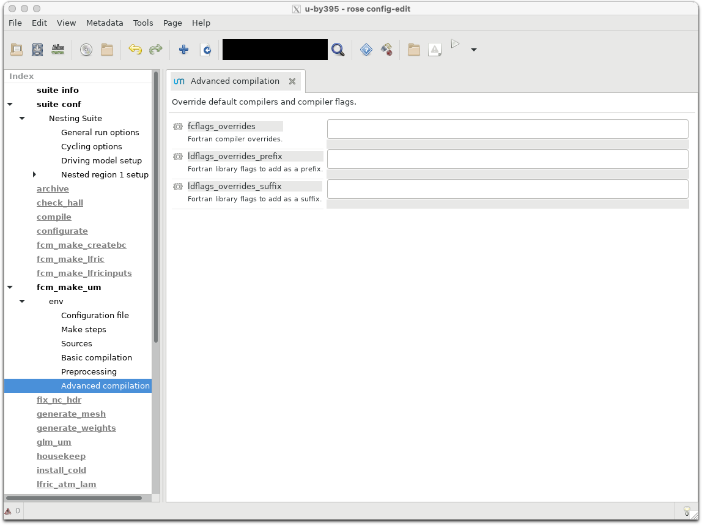
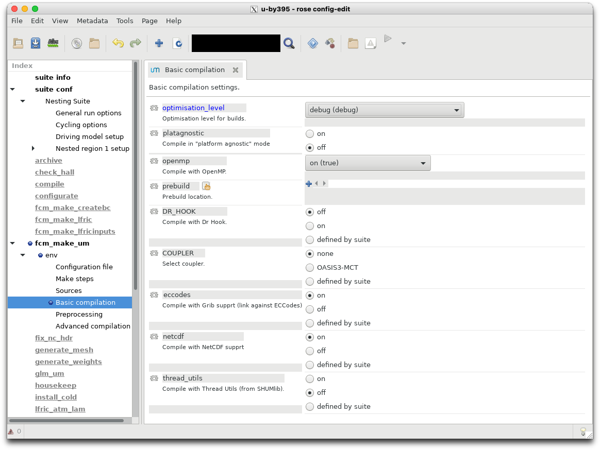
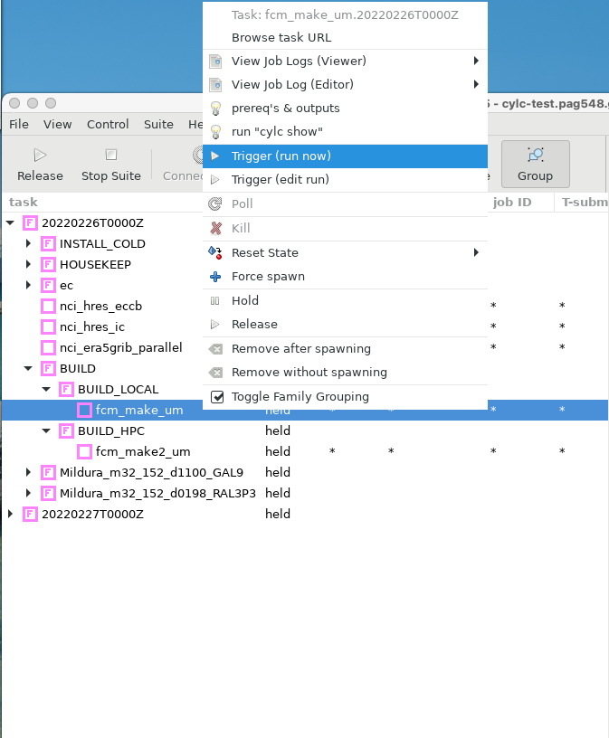
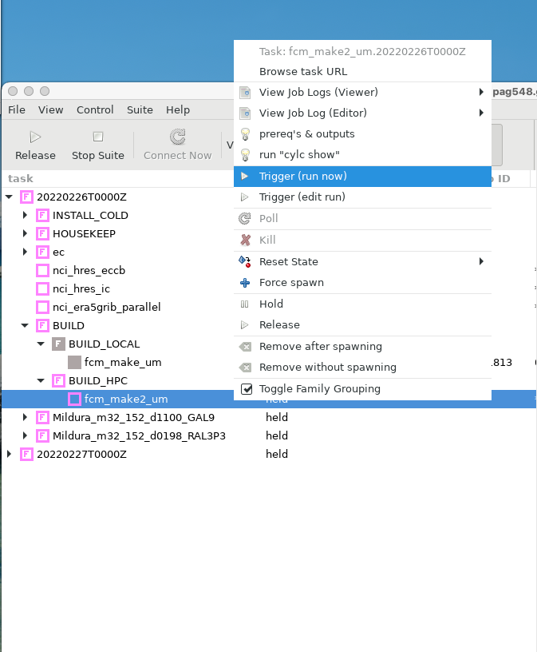

# Custom UM builds for rAM3

The Regional Nesting Suite (RNS) contains the ability to build a custom UM executable. Let's work through the steps required to compile a local exectuable for your own needs.

## Setting the build flag

In the `rose edit` GUI, change the `BUILD_MODE` option in the `General Run options` to `Build new executable`.

You can also change 
```
BUILD_MODE="new"
```
in `rose-suite.conf`.

You may need to check the definition of `HPC_HOST` in `~/roses/<suite-id>/site/nci-gadi/suite-adds.rc`
from
```
{% HPC_HOST = ‘localhost’ % }

```
to
```
{% HPC_HOST = ‘gadi.nci.org.au’ % }
```
Now run your suite hold all tasks.
```
$ rose suite-run -- --hold
```
You will notice a new family of tasks in the GUI: `BUILD`. This task family contains two tasks : `fcm_make_um` and `fcm_make2_um`.

Let's see these how tasks work.

## fcm_make_um

If you look at the `rose` application configuration file for this task:
```
$ more app/fcm_make_um/rose-app.conf 
meta=um-fcm-make/vn13.5

[env]
COUPLER=none
DR_HOOK=false
casim_rev=um13.5
casim_sources=fcm:casim.xm/branches/dev/paulfield/vn1.3_drop_agg_limit_and_switch@11187
compile_atmos=preprocess-atmos build-atmos
!!compile_createbc=preprocess-createbc build-createbc
!!compile_crmstyle_coarse_grid=preprocess-crmstyle_coarse_grid build-crmstyle_coarse_grid
!!compile_pptoanc=preprocess-pptoanc build-pptoanc
compile_recon=preprocess-recon build-recon
!!compile_scm=preprocess-scm build-scm
!!compile_sstpert_lib=preprocess-sstpert_lib build-sstpert_lib
!!compile_wafccb_lib=preprocess-wafccb_lib build-wafccb_lib
config_revision=@vn13.5
config_root_path=fcm:um.xm_tr
config_type=atmos
eccodes=true
extract=extract
fcflags_overrides=
gwd_ussp_precision=double
```
etc.

It contains all the settings required to build version 13.5 of the UM.

For example, if you wanted to add information to the Fortran compiler flag, you could type something like
```
fcflags_overrides=-march=broadwell -axSKYLAKE-AVX512,CASCADELAKE,SAPPHIRERAPIDS
```
to give your UM better performance on other Intel architecture.

You can also access these features in `rose edit`. Select the `fcm_make_um` task on the left panel, wait for the option menu to appear, and then click `env -> Advanced compilation`



The task also contains default settings for optimisation levels. These are available in the `env -> Basic Compilation` menu.



Let's trigger this task.



After completion you will notice that your directory `~/cylc-run/<suite-id>/share/fcm_make_um` exists and contains various files and directories.

The source code for the UM (and its sub components, such as JULES) now lie in `~/cylc-run/<suite-id>/share/fcm_make_um/extract`

So if you wish to add or change any files in the UM source tree, make them in 
`~/cylc-run/<suite-id>/share/fcm_make_um/extract/um/src`

So this task does not build the UM, it just downloads source from the external repositories hosted by the UK Met Office.

Check that your configuration options (e.g. compilation flags) are reflected in the contents of `~/cylc-run/<suite-id>/share/fcm_make_um/fcm-make2.cfg`. 

For example, if you selected to compile with `debug (debug)` optimisation level, the following entries should exist in your `fcm-make2.cfg` file
```
build.prop{class, fc.flags} = -i8 -r8 -mcmodel=medium      -std08  -g -traceback  -assume nosource_include -O2 -fp-model precise -qopenmp      
```

## fcm_make2_um

Once you've made the required changes to your source files and compilation flags, you can then compile your code by triggering `fcm_make2_um`.



When this task finishes, your `job.out` file should contain output similar to the following:
```
[info] sources: total=2909, analysed=2848, elapsed-time=12.0s, total-time=2.1s
[info] target-tree-analysis: elapsed-time=0.1s
[info] install   targets: modified=84, unchanged=0, failed=0, total-time=0.2s
[info] process   targets: modified=2757, unchanged=0, failed=0, total-time=45.1s
[info] TOTAL     targets: modified=2841, unchanged=0, failed=0, elapsed-time=8.5s
[done] make 2 preprocess-atmos# 22.8s
[init] make 2 build-atmos  # 2026-03-02T07:11:19Z
[info] sources: total=2909, analysed=2909, elapsed-time=4.9s, total-time=22.8s
[info] target-tree-analysis: elapsed-time=10.8s
[info] compile   targets: modified=2644, unchanged=0, failed=0, total-time=2910.2s
[info] compile+  targets: modified=2609, unchanged=0, failed=0, total-time=4.8s
[info] install   targets: modified=2, unchanged=0, failed=0, total-time=0.0s
[info] link      targets: modified=1, unchanged=0, failed=0, total-time=10.0s
[info] TOTAL     targets: modified=5256, unchanged=0, failed=0, elapsed-time=593.8s
[done] make 2 build-atmos  # 599.2s
[init] make 2 preprocess-recon# 2026-03-02T07:21:18Z
[info] sources: total=2059, analysed=2011, elapsed-time=4.6s, total-time=1.5s
[info] target-tree-analysis: elapsed-time=0.1s
[info] install   targets: modified=77, unchanged=0, failed=0, total-time=0.2s
[info] process   targets: modified=1927, unchanged=0, failed=0, total-time=39.6s
[info] TOTAL     targets: modified=2004, unchanged=0, failed=0, elapsed-time=8.6s
[done] make 2 preprocess-recon# 13.9s
[init] make 2 build-recon  # 2026-03-02T07:21:32Z
[info] sources: total=2059, analysed=2059, elapsed-time=4.6s, total-time=15.3s
[info] target-tree-analysis: elapsed-time=1.6s
[info] compile   targets: modified=595, unchanged=0, failed=0, total-time=300.4s
[info] compile+  targets: modified=575, unchanged=0, failed=0, total-time=0.8s
[info] install   targets: modified=2, unchanged=0, failed=0, total-time=0.0s
[info] link      targets: modified=1, unchanged=0, failed=0, total-time=2.2s
[info] TOTAL     targets: modified=1173, unchanged=0, failed=0, elapsed-time=60.5s
[done] make 2 build-recon  # 65.5s
[done] make 2              # 702.1s
2026-03-02T07:22:40Z INFO - succeeded
```
This denotes that two UM executables have been built; one each for atmospheric simulations and reconfiguration.

You can check their location and modified times in these directories:
- `~/cylc-run/<suite-id>/share/fcm_make_um/build-atmos/bin`
- `~/cylc-run/<suite-id>/share/fcm_make_um/build-recon/bin`

Detailed logging information during the build process is available at `~/cylc-run/<suite-id>/share/fcm_make_um/fcm-make2.log`. Check this file to ensure any modifications you made to the standard build process, e.g. 
- Altering the compilation flags
- Including new source files,

have been incorporated into the final build process.  In this example, I can check the compilation flags match those specified in the `fcm-make2.cfg`  file.
```
$ grep std08 ~/cylc-run/u-by395/share/fcm_make_um/fcm-make2.log  | more
[info] shell(0  1.1) mpif90 -oo/compute_chunk_size_mod.o -c -I./include -i8 -r8 -mcmodel=medium -std08 -g -tr
aceback -assume nosource_include -O2 -fp-model precise -qopenmp /home/548/pag548/cylc-run/u-by395/share/fcm_m
ake_um/preprocess-atmos/src/um/src/control/misc/compute_chunk_size_mod.F90
```

Any new source files should have their object files located in  `~/cylc-run/<suite-id>/share/fcm_make_um/build-atmos/o`

## Using your new executables

You can continue to run the suite to completion if you like, as all UM related jobs now have added the path to your new executables. For example, here is the job command for the UM reconfiguration task.
```
rose task-run -v --opt-conf-key='(nci-gadi)'  --path="share/fcm_make_um/*/bin" ${TASK_RUN_EXTRA_OPTS:-} --command-key=recon
```
Alternatively, you can stop the suite now, and edit the `rose-suite.conf` file value the `BUILD_MODE` to "custom" and specify the location of the new executables to an `EXEC_DIR`.  Or, using the `rose edit` GUI, you can change `BUILD_MODE` to `Use some other executable on disk`.

You can copy the `build-atmos` and `build-recon` directories to another location (e.g `<path>/Debug_EXES`) and set `EXEC_DIR` to this path. This will ensure your executables are not over-written by future build tasks using this suite.
