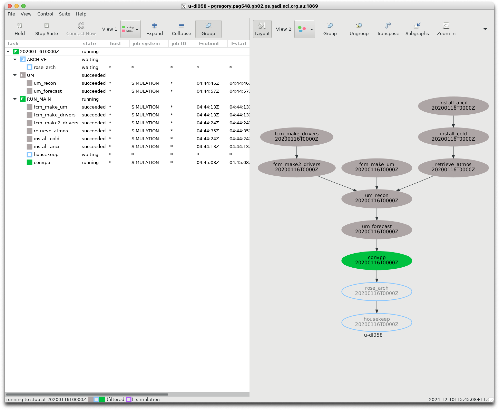
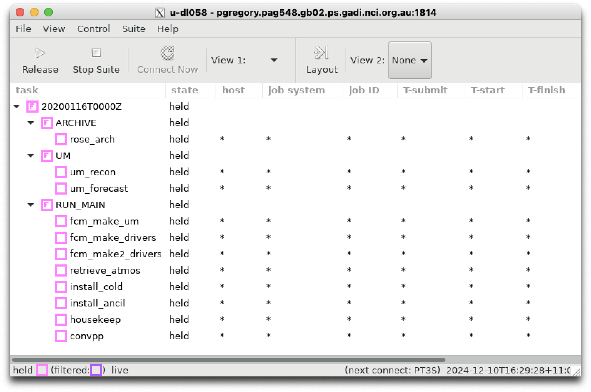
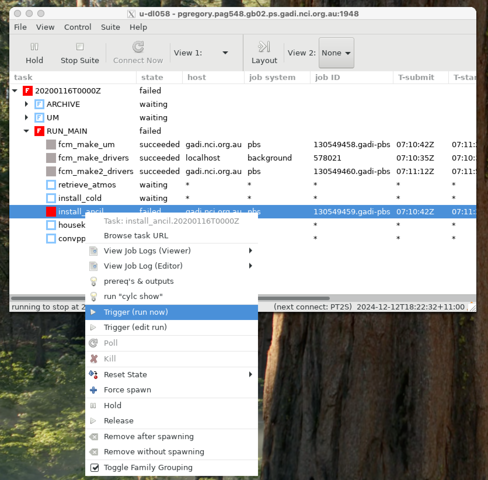
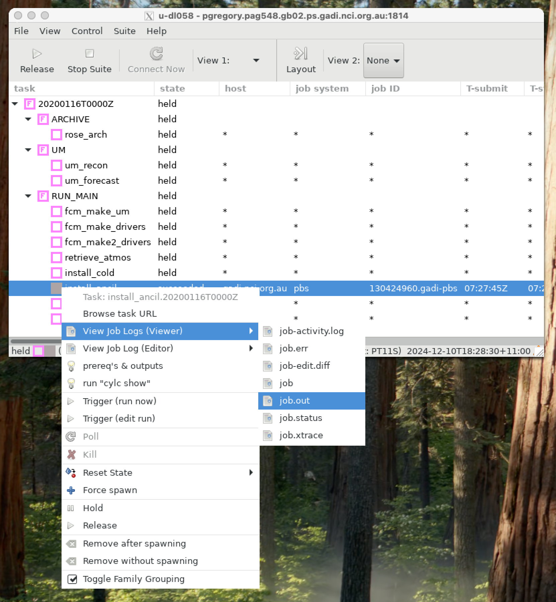

# The Unified Model

The ACCESS modeling suite is reliant on the UK Met Office’s Unified Model (UM) for atmospheric simulations. 

The UM is a collection of Fortran-based executables built to simulate the future state of the atmosphere. It is designed to interface with land/surface and sea-surface data.

The model is so named (i.e. "Unified") because it contains a single set of code that can be applied across a diverse range of length and timescales; from urban weather forecasts at grid resolutions of a few hundred metres, to global climate model projections extending into next century at grid resolutions of hundreds of kilometres.

You can access more detailed information about the UM here : 
https://21centuryweather.github.io/UM_summary_docs/introduction.html

For now, let's concentrate on running a very simple test suite, a 'minimal working example' to demonstrate how we can run the UM on `gadi` using a `rose/cylc` suite.

## Checking out a UM suite ##

If you need to, repeat the steps of the previous tutorial to authenticate your MOSRS credentials. Then, checkout suite `u-dl058` using
```
rosie co u-dl058
```
This suite was initially developed by scientists at the Bureau of Meteorology to research 'coupled' Numerical Weather Prediction using separate atmospheric and ocean models. For this tutorial, we have removed all `rose/cylc` logic related to coupling so the suite performs a simple atmospheric-only global simulation at low resolution.

## Examining the suite ##

The suite contains all the usual files you've become accustomed too inside a `rose/cylc` suite:
- A `rose-app.conf` file to control the master configuration of the suite.
- A `suite.rc` file to control the task flow
- An `app` directory to house `.conf` files for each application task.

Let's step through each task within this suite so we understand at a basic level, how the UM works on `gadi`.

### Master configuration ###

Let's quickly run through the master configuration file : `~/roses/u-dl085/rose-suite.conf`

This contains a list of `bash` environment variables which describe the following:
- `ANCILDATA` : Ancillary data directory
- `ARCHDIR` : Output archive directory
- `ARCHIVE_6HR` : Archiving temporal frequency
- `ATM_PPN` : Number of processors for atmospheric tasks
- `BUILD_UM` : Flag to compile our own UM executable
- `CALENDAR` : Calendar type (important for long climate simulations)
- `CASEDATA` : Directory of case study input files
- `COMPUTE_ACCOUNT` : Your gadi `PROJECT` used for resouce allocation
- `COMPUTE_HOST` : Name of supercomputer 
- `COMPUTE_QUEUE` : PBS job queue used for simulations
- `CONFIG_MODULE_NAME` : Extra module configuration data
- `CORE` : Type of CPU used in supercomputer environment
- `DATES` : List of dates to run simulations for
- `EXTRACT_HOST` : operating system type
- `HOUSEKEEP`: Flag to set housekeeping tasks
- `OCEANDIR` : Location of Ocean data
- `PPN` : Number of processors (generic)
- `QUEUE_PARALLEL` : PBS job queue type
- `RUNTYPE` : Flag for 'coupled' (modeling both the ocean and atmosphere) or 'uncoupled' (atmosphere only) simulation. 
- `RUN_METDB_ODB` : Option to use the UK Met Office Observation Database
- `SITE` : String to denote the supercomputer type
- `STOCHASTIC`: Flag for stochastic atmospheric physics
- `TASKLENGTH` : Data for UM task control
- `TASK_RUN` : Data for UM task control
- `TASK_TESTS` : Flag for UM task control
- `UMDIR` : Master directory for UM files
- `UM_RESOLUTION` : Global atmospheric resolution 
- `USE_COMORPH` : Flag for CoMorph convection scheme
- `USE_DOUBLE_PREC` : Flag for numerical precision
- `xios_path` : Directory of `xios` libraries used by intel compilers. XIOS is an XML input/output server used to handle coupling between the UM atmosphere and the NEMO ocean model.

### Task flow ###

Let's walk through the `suite.rc` file to determine the task flow. 

Before we get to the `graph` section, there are several `jinja` macros (defined using `` constructs) that do the following:
- Set an alias for the rose `TASK_RUN_COMMAND`
- load the required `modules` on gadi
- Set some run-time options based on entries in the `rose-suite.conf` file, including:
    - Numerical precision 
    - Archiving frequency
    - 'CoMorph' convection scheme
    - Stochastic physics settings
- Set aliases for dates based on the input `DATES`
- Set the ensemble number to zero. This suite was originally designed to handle ensemble forecasting and there is ensemble logic embedded in my tasks and scripts. For simplicity's sake, we have removed all the ensemble looping logic and just run for the control forecast, i.e `I = 000`.

The `[cylc]` namespace is for all non task-related configurations. Here we set `UTC` ode to true. The `[events]` namespace allows us to sent notification emails after shutdown.

In the `[scheduling]` namespace we define the number of cycle points based on the input dates. In this example, we will only run for a single forecast date : "20200116T00"

In the `[dependencies]` namespace, we first define the graph to tasks that occur only once : `fcm_make_um`, `install_ancil`, `install_cold`, `fcm_make_drivers` and `fc_make2_drivers`.

We then use a `jinja` macro to loop over all possible to dates to define the tasks that run every every forecast date: `um_recon`, `um_forecast`, `convpp`, `rose_arch` and `housekeep`.

The `[^]` syntax is `cylc` shorthand for 'the initial cycle point', see https://cylc.github.io/cylc-doc/7.8.8/html/suite-config.html#referencing-the-initial-and-final-cycle-points

The `[runtime]` namespace then defines the environment variables and `PBS` job parameters for each task.  The `[root]` namespace defines variables and parameters used by most scripts.  

Next, there are namespaces for each seperate family of tasks. The `[ARCHIVE]` namespace defines the value for `ARCHDIR` from that defined in `rose-suite.conf`.

Below that, there are several dictionaries and macros used to define `PBS` queue and resource requirements for a given resolution. The two main computational tasks in the suite are the `UM` 'Reconfiguration' task, and the `UM` atmospheric forecast task. By default, this suite runs at the lowest available resolution (n320e). The `jinja` dictionary `UM_RES` will return a 10-minute PBS job walltime (`"PT10M"`) to the `cylc` variable `RCF_WALL` and a 4-hour job walltime (`"PT4H"`)to the variable `ATM_WALL`. Other variables are used with the `jinja` macro `node` to provide the number of compute nodes for the reconfiguration (`NODE_RCF`) and atmospheric forecast (`NODE_ATM`) tasks respectively.

The `[UM]` and `[RECONFIGURE]` namespaces then specify the resources fore each task. Below this, there are separate namespaces (in lower case) for each specific task. Each task will inherit environmental parameters defined in the earlier sections.

This `suite.rc` file uses an include statement `%include site/nci_gadi.rc` to include information specific to gadi. When the suite is run, the contents of `site/nci_gadi.rc` will be included in the overall `suite.rc` file that is copied to the run directory `~/cylc-run/u-dl058`. 

For brevity's sake, we won't examine the contents of every namespace within `site/nci_gadi.rc`. But we will note the contents of this file which provides information such as:
- PBS walltime limits
- PBS compute queue
- PBS memory requirements
- Lists of modules to be loaded
- location of ancillary files
for each task environment.

You can see how the suite runs by executing 
```
$ rose suite-run -- --mode=simulation
```
from your `~/roses/u-dl058` directory. This command will run through each task in a 'simulated mode' without actually submitting a PBS job. Make sure you log ito into your persistent session and load your `cylc` modules first!

The graph of the suite looks like this.



### Task summaries

Below is a summary of each task. Each task is called using the commands placed in the `suite.rc` `[root]` namespace, i.e.
```
env-script = eval $(rose task-env)
script = {{TASK_RUN_COMMAND}}
```
where `TASK_RUN_COMMAND` is defined using the `jinja` macro
```

```
The use of `rose task-run` was covered in the third rose tutorial we covered earlier. To referesh your memory, from:

ttps://metomi.github.io/rose/2019.01.8/html/tutorial/rose/suites.html
"When run, rose task-run searches for an application with the same name as the Cylc task in the app/ directory."

Let's manually run through each task in this suite, now that we know the order in which tasks are created via the graph above. We can run the suite in `hold` mode and manually trigger each task. Type
```
$ rose suite-run -- --hold

```
in your `~/rose/u-dl085` directory. This will bring up the suite where each task family is coloured in pink. Left-click on the arrows of each task family to expand them.



Now right-click on `install_ancil` and then left-click `Trigger -> Run now`.



#### install_ancil

This task is run from the `app/install_ancil/` directory. It builds symbolic links between the ancillary files located in the `${UM_ANCIL_DIR}/${GL_UM_RES}` directory on gadi and your local `cylc` working directory `$ROSE_DATA/etc/ancil_gl/`.

When this task completes, the directory `~/cylc-run/u-dl058/share/data/etc/ancil_gl/`will be populated with symbolic links to all the ancillary files.

You can right-click on the task again (which will turn grey after it has successfully) and view the `job.out` file. The `cylc` scheduler will nicely capture all the PBS standard output and collate it into the `job.out` file.



> **__TIP__** Remember you can also look at the job outputs manually. The latest output for this task will be located at
>
>`
>~/cylc-run/u-dl058/log/job/20200116T0000Z/install_ancil/NN/job.out 
>`

Let's follow the same method and trigger all the remaining tasks in sequence.

#### install_cold

This task uses the `bash` script `app/install_cold/bin/install_ver.sh`. It will populate the following directories with symbolic links to initial conditions for the ocean and atmosphere:
- `~/cylc-run/u-dl058/share/data/etc/elements`
- `~/cylc-run/u-dl058/share/data/etc/ocean_startdumps`
- `~/cylc-run/u-dl058/share/data/etc/elements/RMP_DIR_n320e`
- `~/cylc-run/u-dl058/share/data/etc/elements/surf`

There are other directories and files related to verification but they won't be used in this simple suite.

#### fcm_make_drivers

This task uses the script `app/fcm_make_drivers/` to populate the following directories with `python` files used to compile the `UM`.
- `~/cylc-run/u-dl058/share/fcm_make_drivers/mirror/`
- `~/cylc-run/u-dl058/share/fcm_make_drivers/extract/`

#### fcm_make2_drivers

This repeats the same script but with different environment variables to create and populate the following directories with `python` files used to compile the `UM`.
- `~/cylc-run/u-dl058/share/fcm_make_drivers/build/`

#### retrieve_atmos


