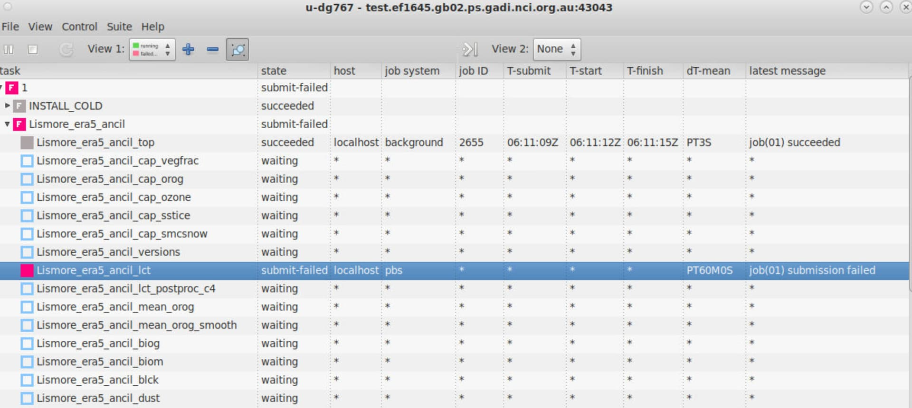

# Common rose/cylc problems

This will be a maintained list of problems encountered (and fixed) with running `rose/cylc` ACCESS tasks.

## Checklist for running rose/cylc

Before diagnosing any `rose/cylc` problems, check
- You are running `rose` on a persistent session
- Your `gadi` project has available compute and storage
- Your home directory isn't full.
- You have run through all the `rose/cylc` tutorials.

## Cannot run suite - IP and key verification error

If your `rose suite-run` command fails with output similar to the following:
```
[WARN] Warning: the ED25519 host key for '[<your persistent session>]:2222' differs from the key for the IP address ' [<IP address>]:2222'
[WARN] Offending key for IP in <known_hosts files> 1
[WARN] Matching host key in <known_hosts file> 3
[WARN] Exiting, you have requested strict checking.
[WARN] Host key verification failed.
[FAIL] <suite id>: does not appear to be running
```
You have tried to run a `rose` suite from a login node. Please try to run the suite again from a persistent session.

## Jobs fail to submit.

If your suite runs, but jobs fail to submit to the PBS queue, your `gadi` project may not be associated with any compute resources.



In this example, the small jobs sent to the `background` queue have been submitted and succeeded. The `background` jobs require no compute resources and run on a `gadi` login node. These can be simple tasks such as creating a symbolic link between an ancillary file in a central directory to your working directory in `~/cylc-run`. 

But any other job that requires compute resources will fail, because your default `gadi` project doesn't have any compute resources allocated to it.  (Some `gadi` projects are for storage only).

To fix this, change the value of `PROJECT` in you `gadi` configuration file to a project that
1. You have membership of
2. Has sufficient computational resources available

See [here](https://opus.nci.org.au/spaces/Help/pages/230490489/FAQ...#FAQ...-'Permissiondenied'messagewhenworkingonanewproject.1) for further information on how to change your default project code on `gadi`.

Make sure the persistent session you are running is also linked to a project with computational resources.

## Jobs submitted but not running

A common issue is that you start your `rose` suite, which submits various jobs, but they never run.

i.e. the job state in the `cylc` GUI is 'submitted' and the job colour is bright green, but the job never begins running and never turns deep green.

This is often caused by disk quota issues. If you have insufficient disk space, either in your home directory, your `/g/data/` or `/scratch` directories, your PBS job will not be allowed to run and will be held indefinitely.

PBS jobs will also be held if there are insufficient project allocations (e.g. you've run out of 'kSU').

See https://opus.nci.org.au/spaces/Help/pages/230490410/Why+are+my+jobs+not+running+...

for more details.

To help manage your disk quota, use some of the commands in this link:

https://opus.nci.org.au/spaces/Help/pages/236880003/Basic+Navigation...

## Editing suite files doesn't update the suite behaviour

If you are editing files within the `rose` suite, but these edits aren't being reflected at runtime, you may have forgotten to `reload` the suite. 

Remember, the `rose` suite files that you checkout from the central MOSRS repository are stored in your `~/roses/<suite-id>` directory.

But the files which control the suite at runtime are located in `~/cylc-run/<suite-id>`.

You must execute `$ rose suite-run -- reload` to update the suite files that control runtime execution.

See [here](./trouble-shooting.md#broken-tasks) for an example.

## Cannot login to a persistent session

If you can't login to your persistent session, you may have conflicting modules which don't use the standard `ssh` environment at NCI. Often the cause of this conflict is the `conda/analysis` module developed by CLEX and maintained by ACCESS-NRI.  You will have to unload any conflicting modules.

See [this link](../mosrs/mosrs-intro.md#persistent-sessions) for more information.

## Persistent session cannot see files in /g/data/access

If you are using a persistent session created before you were a member of the `access` project, your ACCESS suite will be unable to locate any files on `/g/data/access` and hence will fail.

The solution to his problem is to delete your persistent session and create a new one, after you have joined the `access` project.