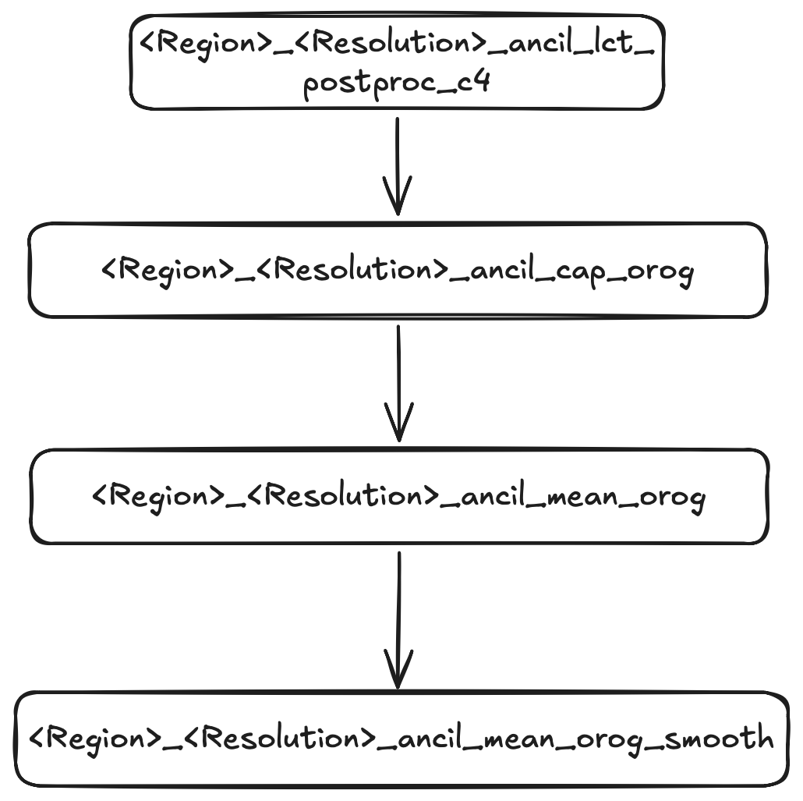
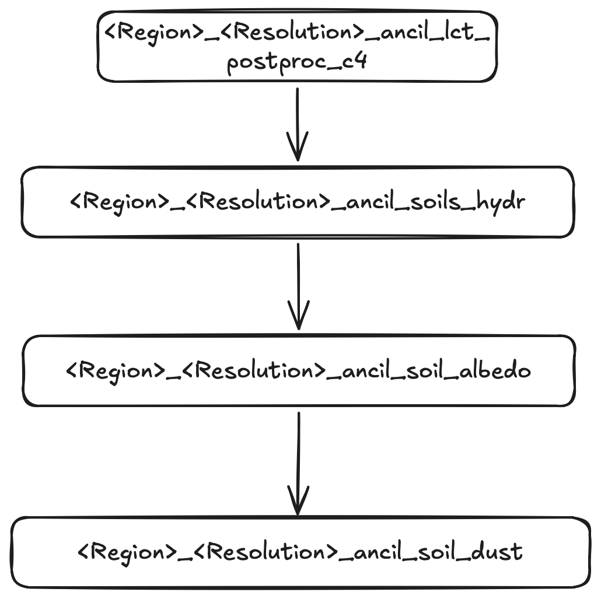
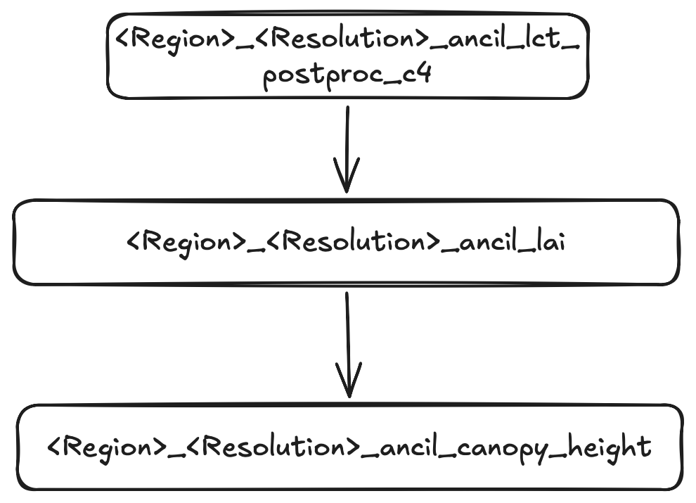
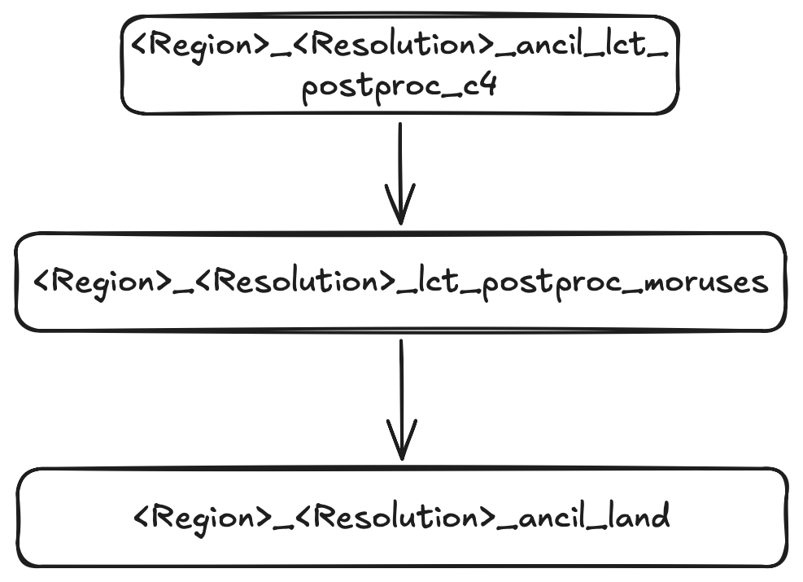
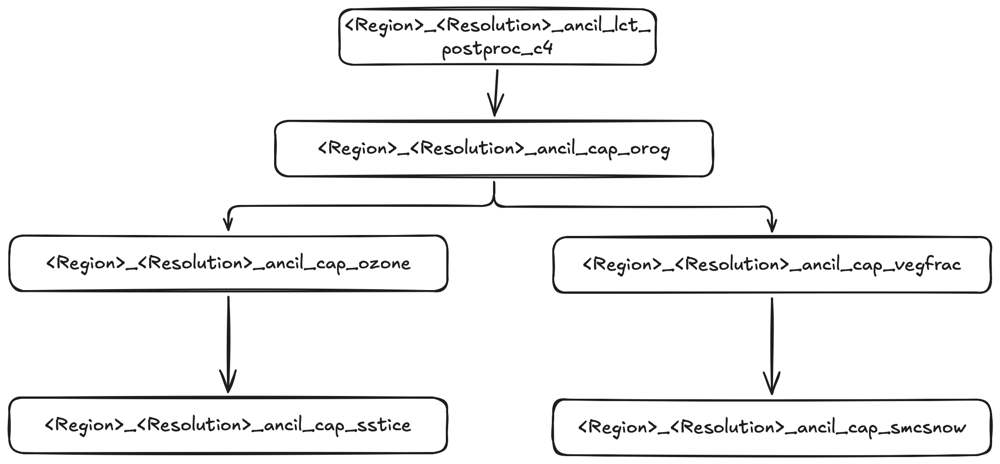

# Regional ancillary generation for atmospheric modeling

In order to run the UM for a specified region, we have to generate files of orography, vegetation, soil and atmospheric parameters (e.g. dust, ozone) that are valid for the specified resolution within our region of interest.

ACCESS NRI maintain a [Regional Ancillary Suite](https://docs.access-hive.org.au/models/run_a_model/run_access-ram3/#ras) which uses global datasets of vegetation cover, orography etc. to generate the necessary ancillary inputs for your regional simulation. 

Using our knowledge of `rose/cylc` we can checkout this suite (`u-bu503`) to our local `~/roses` directory on `gadi`.

The Regional Ancillary Suite must be successfully completed before the regional model can run.

The regional model is run inside the **Regional Nesting Suite**. We will get to that later.

## Nesting

A regional model has to be 'nested' inside an atmospheric dataset which provided initial and boundary conditions for the region of interest. This dataset can take the form of
- Global re-analyses (e.g. ERA5)
- Regional re-analyses (e.g BARRA)
- Global Numerical Weather Prediction forecasts (e.g. ACCESS-G)
- CMIP model projects (e.g. ACCESS-ESM)

:::{important}
In UM parlance, we call this dataset the **driving model**. It provides external information to drive the flow into, and out of, our region.
:::

A UM regional model (sometimes called a local area model) must have a **minimum** of **two** nests. Within the UM, these rests are called 'resolutions'. The UM has the ability to run multiple, spatially disconnected nests simultaneously inside separate regions. This is important for operational weather forecasting, but is not required for our research needs.

For all UM regional modeling tasks, we will only ever run a single 'region' with a minimum of two 'resolutions'.

### Why two resolutions?

To define a UM regional model, we need to define boundary conditions that define the fluxes into, and out of, our domain. In the UM, these boundary conditions take the form of a 'frame' with specific thickness, i.e. they have a preset number of latitude and longitude points so gradients can be computed at the boundaries. See [here](https://21centuryweather.github.io/UM_summary_docs/lbc.html) for a schematic taken from the UM documentation, where the 'External Halo Points' define the spatial thickness of the lateral boundary conditions.

So the **first** resolution or 'nest' defines the spatial resolution of the lateral boundary conditions. It also defines the resolution of the initial condition, i.e. the values of meteorological variables, taken from the external atmospheric dataset that are regridded to our region of interest to initalise the model.

:::{important}
The **first** resolution defined in the Ancillary Suite will be used by the **driving model** in the Regional Nesting Suite.
:::

The **second** resolution or 'nest' defines the spatial resolution of our actual local area model. This is the region where the UM atmospheric forecast will run.

## Configuring a simple test run.

Let's configure a simple test domain and define the minimum number of resolutions (two) for a single region.

You can open the `rose` gui as you have before and edit the following parameters.

When you click save, your `rose-suite.conf` file should now contain the following entries.

These entries refer to:
- `rg01_name` :Name of first (and only) region
- `rg01_rs01` : etc

## Running the suite.

We will now run the suite. The tasks tree will unfold and you can watch the tasks execute in realtime. For this example, the whole suite will execute in a manner of minutes.

:::{note}

A Jupyter notebook is available at [] which contains much of the information below. You can use that notebook to follow these steps below and visualise all the ancillaries you have generated.
:::

### Top level ancillary task

Running task `<Region>_<Resolution>_ancil_top` installs the following files:
- `vertlevs.nl`
- `grid.nl`
- `L70_80km`
- `grid_eg.nl`

Into your local ancillary directory (which should be `~/cylc-run/u-bu503/share data/ancils/Test`). These are ASCII files which define the spatial boundaries of both resolutions that exist inside the single region `Test`.

:::{note}
In this document (and the associated Jupyter notebook) the `cylc` tasks are called `<Region>_<Resolution>_etc` where `<Region>` and `<Resolution>` will be assigned the values that were prescribed in your `rose-suite.conf` file. So the tasks may have the name `Lismore_era5_` in your actual ancillary suite.
:::

### Land Cover tasks (LCT)

Next we generate the ancillaries that defines the vegetation and land cover over our land-sea mask om our region of interest. This is a three step process done across three separate tasks.

The first task is `<Region>_<Resolution>_ancil_lct` that generates the following files:
- `qrparm.veg.frac_cci_pre_c4` (9 level vegetation grids in UM ancillary binary format)
- `qrparm.veg.frac_cci_pre_c4.nc` (as above, but in netCDF format)

It also renames our original land-sea mask `qrparm.mask` to `qrparm.mask_cci` and then generates a symbolic link to the renamed file. This is done to track providence of the mask generation (i.e. using CCI datasets)

Next the vegetation ancillaries are altered to include the latest 'World Cover' data. This step allows better representation of urban areas. This step uses the task `<Region>_<Resolution>_ancil_lct_postproc_wc_urban`. It will update the files:
- `qrparm.veg.frac_cci_pre_c4`
- `qrparm.veg.frac_cci_pre_c4.nc`

and generate the files
- `qrparm.veg.frac_cci_pre_c4_pre_wc`
- `qrparm.veg.frac_cci_pre_c4_pre_wc.nc`

We then complete the vegetation processing with the task `<Region>_<Resolution>_ancil_lct_postproc_c4``. This injects 'C4' data into the land cover type fraction dataset, and produces the output files:
- `qrparm.veg.frac_cci`
- `qrparm.veg.frac_cci.nc`

A symbolic link is created to both of these files which removes the last suffix, i.e.
- `qrparm.veg.frac -> qrparm.veg.frac_cci`
- `qrparm.veg.frac.nc -> qrparm.veg.frac_cci.nc`

The following flowchart summarises the task flow to generate the vegetation land cover classification ancillaries.


Now the final vegetation land cover classification ancillaries have been created, the suite splits and launches many tasks in parallel. Some tasks are grouped into their own subclasses with their own dependencies, such as

- orography
- soil characteristics
- leaf areas and canopy heights
- ice and snow
- moruses

Let's review the orography set of tasks first.

### Orography

The first orography task is `<Region>_<Resolution>_ancil_cap_orog`. Any tasks that contain cap in their task name do not use the python `ants` library. Rather they use the older UM binary. E.g. this task is launched with the command
```
$ more app/ancil_cap_orog/rose-app.conf 
meta=ancilOrog

[command]
default=rose mpi-launch -v central_ancillary.exe
```
The task `<Region>_<Resolution>_ancil_cap_orog` creates the file `qrparm.orog`.

The next orography task is `<Region>_<Resolution>_ancil_mean_orog`. This is two-step task that firstly

- produces a concatenated SRTM orography file `orog_srtm/SRTM_concat.nc` (which is a global dataset)
- then produces the file `orog_srtm/qrparm.orog.srtm.nc`

The final orography task is `<Region>_<Resolution>_ancil_mean_orog_smooth`, which smooths the SRTM data according to a variety of algorithms. This produces the following files in `./orog_srtm/`:

- `qrparm.orog.srtm.121x1`
- `qrparm.orog.srtm.121x10`
- `qrparm.orog.srtm.121x100`
- `qrparm.orog.srtm.121x20`
- `qrparm.orog.srtm.121x35`
- `qrparm.orog.srtm.121x5`
- `qrparm.orog.srtm.121x50`
- `qrparm.orog.srtm.121x75`
In the main ancillary directory, a symbolic link `qrparm.orog.mn` links to `orog_srtm/qrparm.orog.srtm.121x1`

The following flowchart describes the task flows for orography related tasks.



### Soil characteristics

The next set of multi-step tasks are related to generating soil characteristics. First, we begin with the task `<Region>_<Resolution>_ancil_soils_hydr`. This reads in the global `soils_hydrology.nc` file, regrids it to our target domain, and saves it to `soil_hydrology`.

Next we process the soil albedo with the task `<Region>_<Resolution>_ancil_soil_albedo`. This reads in the global dataset `soil_albedo.nc` along with the existing files:
- `soil_hydrology`
- `qrparm.veg.frac.nc` 

and outputs `qrparm.soil_cci`. The global albedo dataset may require manual inputs to provide data for small islands. It is defined on 0.05 degree grid. The coarse nature of the global albedo data may also cause small domains to fail, e.g. if the bounds of your domains fail to pick up any albedo data points.

The last task in this dependency is `<Region>_<Resolution>_ancil_soil_dust`. This processes the `qrparm.soil_cci` and `qrparm.veg.frac` ancillary files and generates the ancillary `qrparm.soil.dust`.

The flowchart below describes the dependencies of the above soil-related tasks.



There are two stand-alone soils tasks.

The first is `<Region>_<Resolution>_ancil_soil_roughness` which uses the existing `qrparm.veg.frac.nc` file along with global MODIS leaf area index data and global soil roughness data to produce `qrparm.soil_roughness`.

The second task is related to soil hydrology and is called `<Region>_<Resolution>_ancil_topographic_index`. It also uses `qrparm.veg.frac.nc` file along with global topographic wetness index data to produce `qrparm.hydtop`.

### Leaf and canopy data

We need to populate the vegetation files with leaf and canopy data. The first task is `<Region>_<Resolution>_ancil_lai `which processes 'Leaf Area Index' and produces a temporary file `lai`.

The next task `<Region>_<Resolution>_ancil_canopy_heights` combines the lai ancillary with tree data and canopy height factors and writes the data to `qrparm.veg.func`.

The flowchart below describes the dependencies of the above leaf and canopy-related tasks.



### Urban surface exchange and land climatology

The task `<Region>_<Resolution>_ancil_lct_postproc_moruses` performs a two-type urban fraction and urban morphology post-processor to implement the Met Office–Reading Urban Surface Exchange Scheme (MORUSES). The intermediate output file is `qrparm.MORUSES.morph`

The downstream task is `<Region>_<Resolution>_ancil_lct_land` which actually runs the application `app/ancil_snowfree_albedo/rose-app.conf`. The suite logic in `suite-runtime/ants.rc` states:
```
    [[{{ancil(regn, resln)}}_land]]
        # SW snow-free surface albedo.
        inherit = {{ancil(regn, resln)}},ANCIL_SNOWFREE_ALBEDO
```
and
```
    [[ANCIL_SNOWFREE_ALBEDO]]
        inherit = ANCIL_ANTS, HOST_ANTS_MPP
        [[[environment]]]
            ROSE_TASK_APP=ancil_snowfree_albedo
```
The output of this task is `qrclim.land`. The flowchart below describes the dependencies of the above soil-related tasks.



### Process Sea Surface Temperature/Ice, soil moisture content snow

The last multi-step tasks which contain a chain of dependencies begins with  `<Region>_<Resolution>_ancil_cap_vegfrac`. Like the previous `ancil_cap` task, this uses an older FORTRAN binary and is independent of the python-based `ants` workflow.

This task outputs
- `qrparm.veg.func_igbp`
- `qrparm.veg.frac_igbp`
- `qrparm.veg.dist`
- `qrparm.soil.dust_igbp`
And it updates `qrparm.soil`.

There are two tasks downstream of `<Region>_<Resolution>_ancil_cap_vegfrac`. One is `<Region>_<Resolution>_ancil_cap_sstice`. This task processes global climatologies for sea-ice and Sea Surface Temperatures (SSTs):
- `qrclim.sst`
- `qrclim.seaice`

The other task is `<Region>_<Resolution>_ancil_cap_smcsnow`. This task processes global climatologies for soil moisture content and snow. The output is `qrclim.smow`.

The flowchart below shows the task dependencies for all cap related tasks.



### Remaining stand-alone tasks

The last stand-alone tasks can be divided into three sections. The first is ozone processing: `<Region>_<Resolution>_ancil_cap_ozone` which uses the FORTRAN `cap` executable. 

The next group of tasks compute aerosol climatologies as specified in the `suite.rc`
```


<Region>_<Resolution>_ancil_ocff
<Region>_<Resolution>_ancil_biog
<Region>_<Resolution>_ancil_biom
<Region>_<Resolution>_ancil_blck
<Region>_<Resolution>_ancil_sslt
<Region>_<Resolution>_ancil_sulp
<Region>_<Resolution>_ancil_dust
```
They simply regrid the global climatologies of these quantities onto the local lat/lon grid and the specified vertical levels. They output both UM ancillary format and netCDF files.

These are the remaining tasks that use the python `ants` workflows.
```
<Region>_<Resolution>_ancil_topographic_index
<Region>_<Resolution>_ancil_clim_sea
<Region>_<Resolution>_ancil_lake
```
Let's examine the outputs of these tasks.

`<Region>_<Resolution>_ancil_cap_ozone` produces the local ozone climatology `qrclim.ozone.unfix`

Let's now examine the aerosol climatologies:

- `<Region>_<Resolution>_ancil_ocff` produces dry aerosol climatologies of organic carbon from fossil fuels and is stored in `qrclim.ocff`.
- `<Region>_<Resolution>_ancil_sulp` produces dry aerosol climatologies of sulfate and is stored in `qrclim.sulp`.
- `<Region>_<Resolution>_ancil_biog` produces aerosol climatologies of biogenic Non-Methane Volatile Organic Compounds and is stored in `qrclim.biog`.
- `<Region>_<Resolution>_ancil_blk` produces aerosol climatologies of black carbon and are stored in `qrclim.blck`.
- `<Region>_<Resolution>_ancil_biom` produces aerosol climatologies of fresh burning biomass and is stored in `qrclim.biom`.
- `<Region>_<Resolution>_ancil_sslt` produces aerosol climatologies of sea salt particles and is stored in `qrclim.sslt`.
- `Region>_<Resolution>_ancil_dust` produces aerosol climatologies of dust and is stored in `qrclim.dust`.


The remaining tasks are :

- `<Region>_<Resolution>_ancil_clim_sea` which produces climatology of ocean chlorophyll concentrations which are stored in `qrclim.sea`
- `<Region>_<Resolution>_ancil_lake` which regrids the global lake mask dataset and produces the local ancillary file `qrparm.lake`.