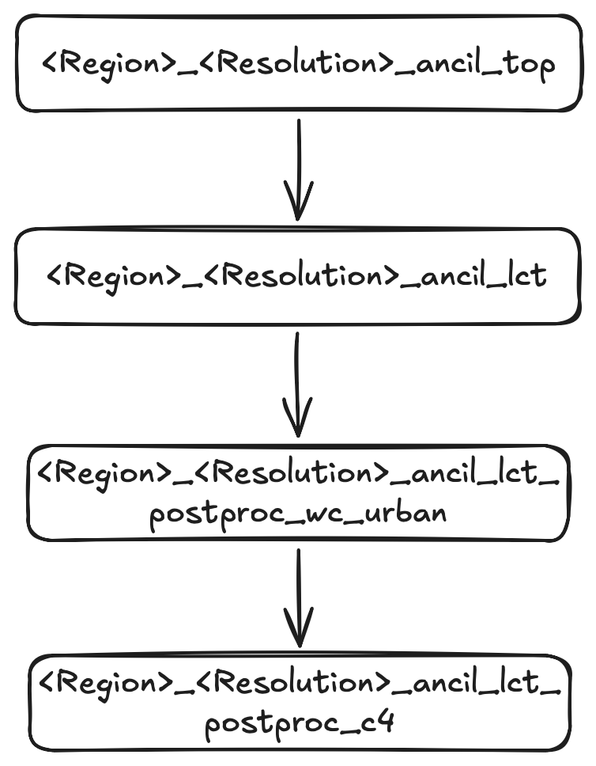

# Regional ancillary generation for atmospheric modeling

In order to run the UM for a specified region, we have to generate files of orography, vegetation, soil and atmospheric parameters (e.g. dust, ozone) that are valid for the specified resolution within our region of interest.

ACCESS NRI maintain a [Regional Ancillary Suite](https://docs.access-hive.org.au/models/run_a_model/run_access-ram3/#ras) which uses global datasets of vegetation cover, orography etc. to generate the necessary ancillary inputs for your regional simulation. 

Using our knowledge of `rose/cylc` we can checkout this suite (`u-bu503`) to our local `~/roses` directory on `gadi`.

The Regional Ancillary Suite must be successfully completed before the regional model can run.

The regional model is run inside the **Regional Nesting Suite**. We will get to that later.

## Nesting

A regional model has to be 'nested' inside an atmospheric dataset which provided initial and boundary conditions for the region of interest. This dataset can take the form of
- Global re-analyses (e.g. ERA5)
- Regional re-analyses (e.g BARRA)
- Global Numerical Weather Prediction forecasts (e.g. ACCESS-G)
- CMIP model projects (e.g. ACCESS-ESM)

:::{important}
In UM parlance, we call this dataset the **driving model**. It provides external information to drive the flow into, and out of, our region.
:::

A UM regional model (sometimes called a local area model) must have a **minimum** of **two** nests. Within the UM, these rests are called 'resolutions'. The UM has the ability to run multiple, spatially disconnected nests simultaneously inside separate regions. This is important for operational weather forecasting, but is not required for our research needs.

For all UM regional modeling tasks, we will only ever run a single 'region' with a minimum of two 'resolutions'.

### Why two resolutions?

To define a UM regional model, we need to define boundary conditions that define the fluxes into, and out of, our domain. In the UM, these boundary conditions take the form of a 'frame' with specific thickness, i.e. they have a preset number of latitude and longitude points so gradients can be computed at the boundaries. See [here](https://21centuryweather.github.io/UM_summary_docs/lbc.html) for a schematic taken from the UM documentation, where the 'External Halo Points' define the spatial thickness of the lateral boundary conditions.

So the **first** resolution or 'nest' defines the spatial resolution of the lateral boundary conditions. It also defines the resolution of the initial condition, i.e. the values of meteorological variables, taken from the external atmospheric dataset that are regridded to our region of interest to initalise the model.

:::{important}
The **first** resolution defined in the Ancillary Suite will be used by the **driving model** in the Regional Nesting Suite.
:::

The **second** resolution or 'nest' defines the spatial resolution of our actual local area model. This is the region where the UM atmospheric forecast will run.

## Configuring a simple test run.

Let's configure a simple test domain and define the minimum number of resolutions (two) for a single region.

You can open the `rose` gui as you have before and edit the following parameters.

When you click save, your `rose-suite.conf` file should now contain the following entries.

These entries refer to:
- `rg01_name` :Name of first (and only) region
- `rg01_rs01` : etc

## Running the suite.

We will now run the suite. The tasks tree will unfold and you can watch the tasks execute in realtime. For this example, the whole suite will execute in a manner of minutes.

:::{note}

A Jupyter notebook is available at [] which contains much of the information below. You can use that notebook to follow these steps below and visualise all the ancillaries you have generated.

### Top level ancillary task

Running task `<Region>_<Resolution>_ancil_top` installs the following files:
- `vertlevs.nl`
- `grid.nl`
- `L70_80km`
- `grid_eg.nl`

Into your local ancillary directory (which should be `~/cylc-run/u-bu503/share data/ancils/Test`). These are ASCII files which define the spatial boundaries of both resolutions that exist inside the single region `Test`.

### Land Cover tasks LCT

Next we generate the ancillaries that defines the vegetation and cover over our our land-sea mask inside our region of interest. This is a three step process done across three separate tasks.

The first task is `<Region>_<Resolution>_ancil_lct` that generates the following files:
- `qrparm.veg.frac_cci_pre_c4` (9 level vegetation grids in UM ancillary binary format)
- `qrparm.veg.frac_cci_pre_c4.nc` (as above, but in netCDF format)

It also renames our original land-sea mask `qrparm.mask` to `qrparm.mask_cci` and then generates a symbolic link to the renamed file. This is done to track providence of the mask generation (i.e. using CCI datasets)

Next the vegetation ancillaries are altered to include the latest 'World Cover' data. This step allows better representation of urban areas. This step uses the task `<Region>_<Resolution>_ancil_lct_postproc_wc_urban`. It will update the files:
- `qrparm.veg.frac_cci_pre_c4`
- `qrparm.veg.frac_cci_pre_c4.nc`

and generate the files
- `qrparm.veg.frac_cci_pre_c4_pre_wc`
- `qrparm.veg.frac_cci_pre_c4_pre_wc.nc`

We then complete the vegetation processing with the task `<Region>_<Resolution>_ancil_lct_postproc_c4``. This injects 'C4' data into the land cover type fraction dataset, and produces the output files:
- `qrparm.veg.frac_cci`
- `qrparm.veg.frac_cci.nc`

A symbolic link is created to both of these files which removes the last suffix, i.e.
- `qrparm.veg.frac -> qrparm.veg.frac_cci`
- `qrparm.veg.frac.nc -> qrparm.veg.frac_cci.nc`

The following flowchart summarises the task flow to generate the vegetation land cover classification ancillaries.

