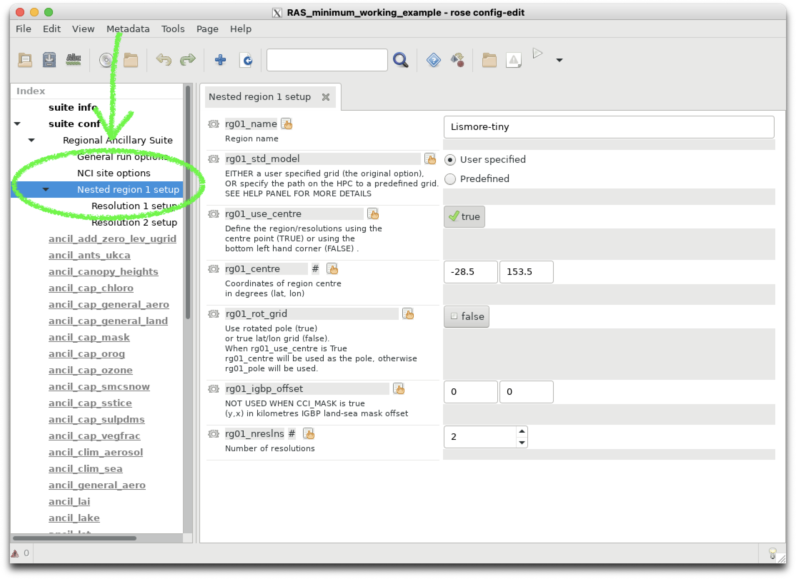
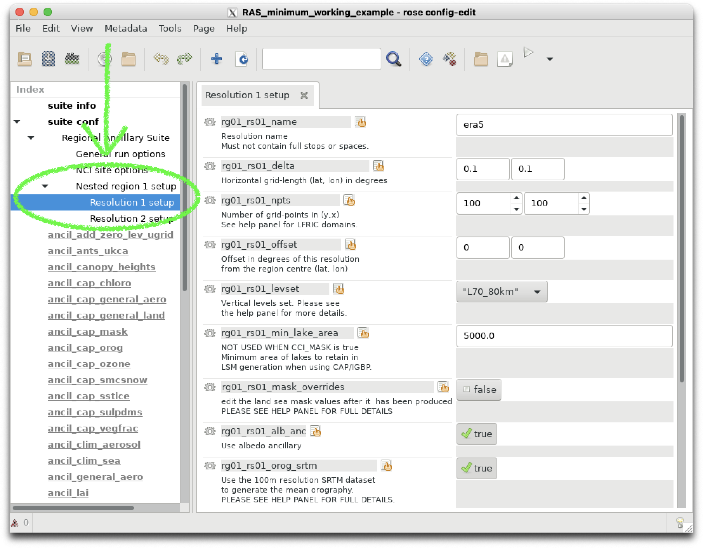
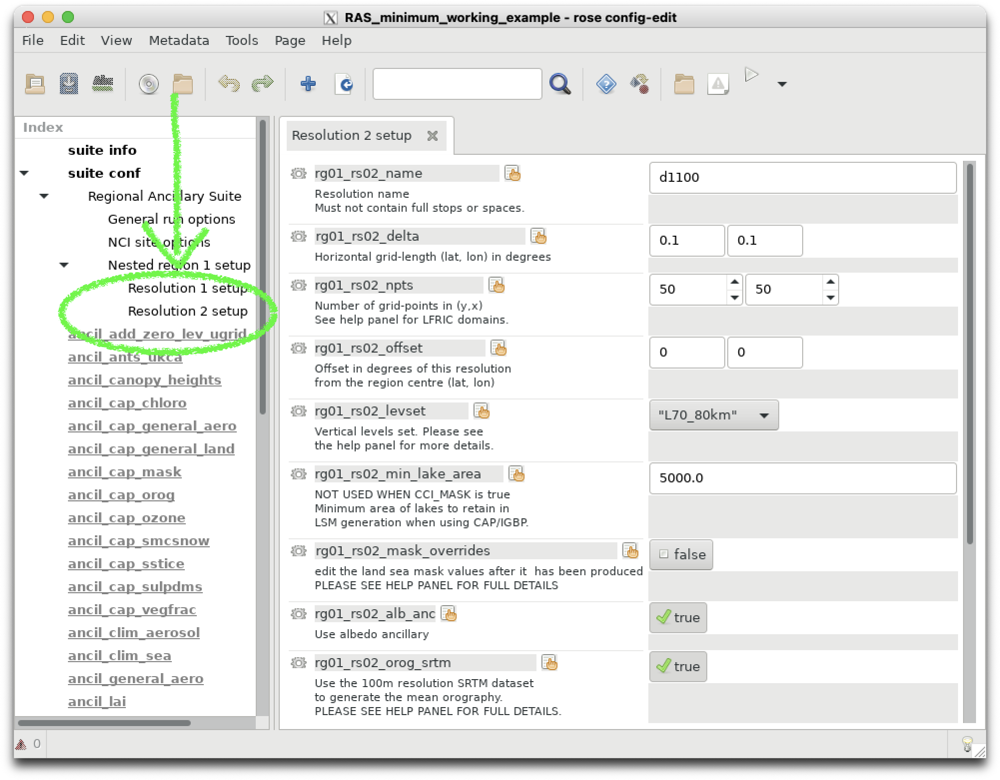

# Regional ancillary generation for atmospheric modeling

In order to run the UM for a specified region, we have to generate files of orography, vegetation, soil and atmospheric parameters (e.g. dust, ozone) that are valid for the specified resolution within our region of interest.

ACCESS NRI maintain a [Regional Ancillary Suite](https://docs.access-hive.org.au/models/run_a_model/run_access-ram3/#ras) which uses global datasets of vegetation cover, orography etc. to generate the necessary ancillary inputs for your regional simulation. 

The Regional Ancillary Suite must be successfully completed before the regional model can run.

The regional model is run inside the **Regional Nesting Suite**. We will get to that later.

## Nesting

A regional model has to be 'nested' inside an atmospheric dataset which provided initial and boundary conditions for the region of interest. This dataset can take the form of
- Global re-analyses (e.g. ERA5)
- Regional re-analyses (e.g BARRA)
- Global Numerical Weather Prediction forecasts (e.g. ACCESS-G)
- CMIP model projects (e.g. ACCESS-ESM)

:::{important}
In UM parlance, we call this dataset the **driving model**. It provides external information to drive the flow into, and out of, our region.
:::

A UM regional model (sometimes called a local area model) must have a **minimum** of **two** nests. Within the UM, these rests are called 'resolutions'. The UM has the ability to run multiple, spatially disconnected nests simultaneously inside separate regions. This is important for operational weather forecasting, but is not required for our research needs.

For all UM regional modeling tasks, we will only ever run a single 'region' with a minimum of two 'resolutions'.

### Why two resolutions?

To define a UM regional model, we need to define boundary conditions that define the fluxes into, and out of, our domain. In the UM, these boundary conditions take the form of a 'frame' with specific thickness, i.e. they have a preset number of latitude and longitude points so gradients can be computed at the boundaries. See [here](https://21centuryweather.github.io/UM_summary_docs/lbc.html) for a schematic taken from the UM documentation, where the 'External Halo Points' define the spatial thickness of the lateral boundary conditions.

So the **first** resolution or 'nest' defines the spatial resolution of the lateral boundary conditions. It also defines the resolution of the initial condition, i.e. the values of meteorological variables, taken from the external atmospheric dataset that are regridded to our region of interest to initalise the model.

:::{important}
The **first** resolution defined in the Ancillary Suite will be used by the **driving model** in the Regional Nesting Suite.
:::

The **second** resolution or 'nest' defines the spatial resolution of our actual local area model. This is the region where the UM atmospheric forecast will run.

## Configuring a simple test run.

Let's configure a simple test domain and define the minimum number of resolutions (two) for a single region.

We can checkout a minimal working example of the Regional Ancillary Suite here : https://github.com/21centuryweather/RAS_minimum_working_example by typing the following at the command line from your `~/roses/` directory:
```
$ cd ~/roses
$ git clone git@github.com:21centuryweather/RAS_minimum_working_example.git
```
:::{note}
This assumes you can access the Centre's GitHub repository via ssh. If that command doesn't work, visit the Centre's Wiki [here](https://21centuryweather.github.io/21st-Century-Weather-Software-Wiki/git/git-intro.html#configure-the-permissions-between-git-and-github)
:::

You can open the `rose` GUI as you have before and click on `suite conf` -> `Regional Ancillary Suite` -> `Nested region 1 setup` to view the definition of Region 1.



Clicking on `Resolution 1 setup` and `Resolution 2 setup` shows the definitions of our two Resolutions.




Note how these values are stored in the suite's `rose-suite.conf` file:
```
# Define the number of regions
nregns=1
#Define define the regions
rg01_centre=-28.49,153.45
rg01_igbp_offset=0,0
rg01_name="Lismore-tiny"
# Define the number of resolutions
rg01_nreslns=2
...
# Define the first outer resolution that is used by the 'driving model'
rg01_rs01_delta=0.1,0.1
rg01_rs01_levset="L70_80km"
...
rg01_rs01_name="era5"
rg01_rs01_npts=100,100
...
# Define the second inner resolution that is used by the
...
rg01_rs02_delta=0.1,0.1
rg01_rs02_levset="L70_80km"
...
rg01_rs02_name="d1100"
rg01_rs02_npts=50,50
```
## Running the suite.

We will now run the suite. The tasks tree will unfold and you can watch the tasks execute in realtime. For this example, the whole suite will execute in a manner of minutes.

```
$ rose suite-run
```
:::{note}

A Jupyter notebook is contained in the suite directory in 
```
~/roses/RAS_minimum_working_example/RAS_ancils.ipynb
```
 which you can use to visualise all the ancillaries you have generated. 
 The notebook also contains more information on the taskflows within the ancillary suite and their dependencies. Useful when you hit problems building ancillaries for your own experiments!
:::

