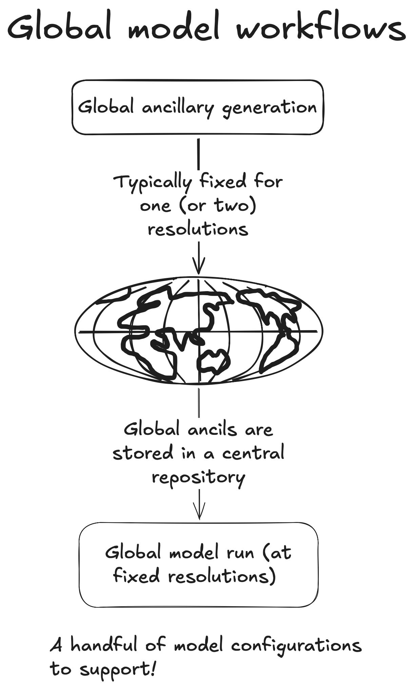
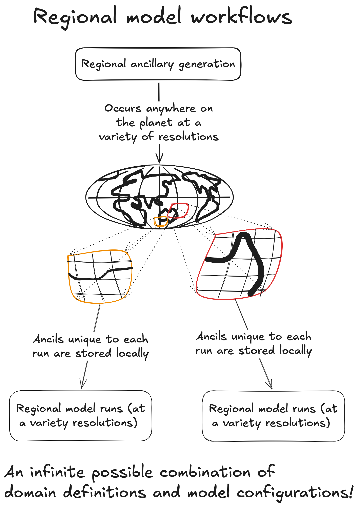

# Regional Atmospheric Modeling

The previous UM suite you checked out and ran [here](../UM/UM-intro.md) was a global atmospheric model.

For many researchers in the Centre, you will instead be using a **regional** atmospheric model. The main advantage of using a regional model is we can focus our computational resources to investigate a specific phenomena or case study at very high resolution, without having to resolve the land and atmosphere for the rest of the planet.

The disadvantage of regional modelling is that it adds additional layers of complexity. 

Consider the figure below.

{width=50%}

If we consider the case of the ACCESS global model AM3 (which is detailed [here](../AM3/intro.md)) this global model has been configured at two fixed resolutions:
- N96 (~ 135 km resolution)
- N512 (~ 25 km resolution)

In order to run the UM at these resolution, global **ancillaries** need to be generated which define all the quantities required to run a simulation of the global atmosphere, such as 
- A land/sea mask (defining the extents of the land and ocean)
- Orography (i.e. mountains, valleys and plateaus)
- Vegetation cover and soil properties
- Climatologies of ozone, dust and other aerosols
- Sea Surface Temperature values (either prescribed of climatologies)
etc.

These ancillaries are unique for each fixed resolution and will be stored on disk.

The processor layout (how the UM is parallelised across multiple cores) will also be tested and fixed for a prescribed resolution.

When running a global experiment, the researcher will generally only perturb one or two parameters. They will leverage off the existing ancillary and configuration files that are stored in a central repository.

In conclusion, maintaining and running a global model is very simple once the initial work to create ancillaries and test the stability of the suite has been complete.

Now, consider the case of a regional atmospheric model

{width=50%}

Regional models are not 'set and forget' like a global model. Each experiment is essentially a unique instance of the UM and hence regional modeling suites are much harder to develop and maintain than global models.

These additional levels of complexity create many more failure modes compared with a global model run.  

Some of the issues a regional modeler has to content with include:
- Selecting the driving model inputs
- Configuring boundary conditions
- Selecting the processor layout
- Ancillary generation in problematic regions (small islands, mountains etc.)

Note all of these issues apply to regional ocean modeling (which is done using the MOM6 model). Regional ocean modeling is slightly less complex, as they have a lower number of regional ancillary files to generate. Typically bathymetry is all that is required.

When dealing with regional coupled modeling, one has to address the specific domain expertise required to run both the atmospheric component (via the UM) and the ocean component (via MOM6) as the workflows of both these models have significant differences and the nuances to run both components in regional configurations are typically only known to model developers and expert users.

The first step to mastering regional atmospheric modeling is to understand how how the UM generates regional ancillaries via the Regional Nesting Suite.