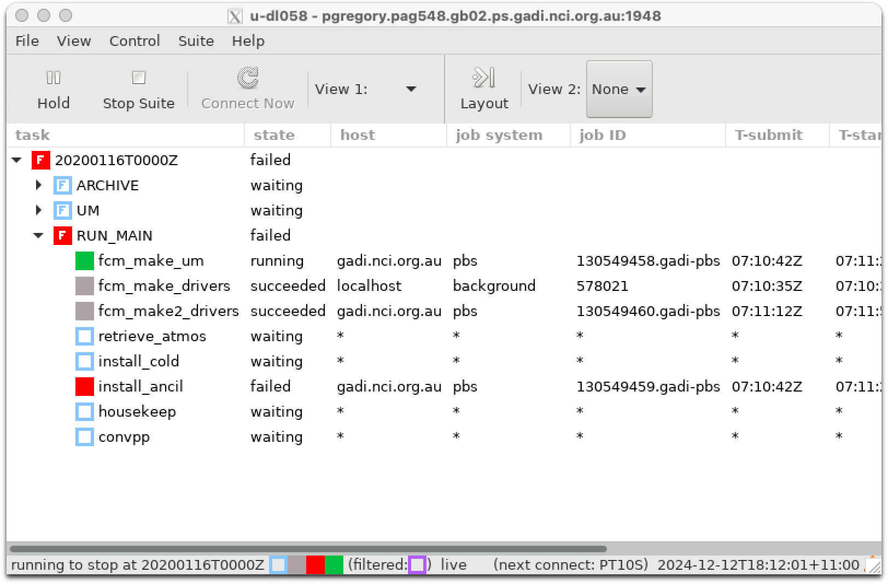
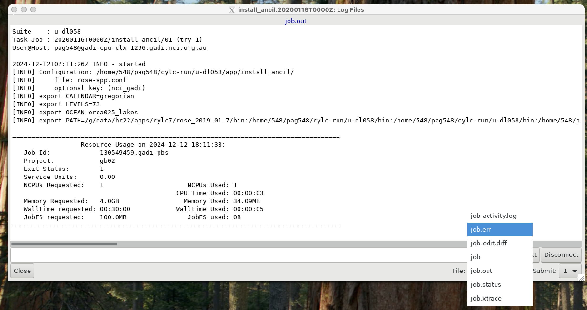
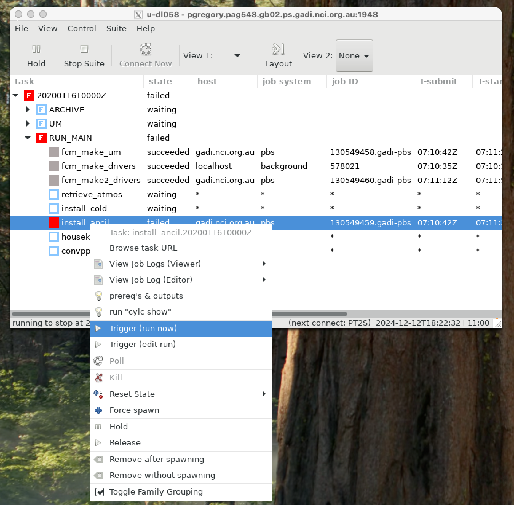

# Trouble Shooting

Running the UM can be fraught. Tasks often fail. Let's break a task on purpose with our test suite `u-dl058` and learn how to diagnose problems and re-start suites.

## Broken tasks

Let's break the suite on purpose so we can practise dealing with problems. Let's break the `install_ancil` task.

In `app/install_ancil/rose-app.conf` let's change the environment variable `LEVELS` from 70 to 73.
i.e. change this section of the file from
```
[env]
CALENDAR=gregorian
LEVELS=70
OCEAN=orca025_lakes
```
to this
```
[env]
CALENDAR=gregorian
LEVELS=73 
OCEAN=orca025_lakes
```
Now, let's run the suite.
```
$ rose suite-run
```
That task will fail, while the `fcm_make` tasks will continue.



Let's look a the `job.out` file for this task.
```
Suite    : u-dl058
Task Job : 20200116T0000Z/install_ancil/01 (try 1)
User@Host: pag548@gadi-cpu-clx-1296.gadi.nci.org.au

2024-12-12T07:11:26Z INFO - started
[INFO] Configuration: /home/548/pag548/cylc-run/u-dl058/app/install_ancil/
[INFO]     file: rose-app.conf
[INFO]     optional key: (nci_gadi)
[INFO] export CALENDAR=gregorian
[INFO] export LEVELS=73
[INFO] export OCEAN=orca025_lakes
[INFO] export PATH=/g/data/hr22/apps/cylc7/rose_2019.01.7/bin:/home/548/pag548/cylc-run/u-dl058/bin:/home/548/pag548/cylc-run/u-dl058/bin:/home/548/pag548/cylc-run/u-dl058/share/fcm_make_um/build-recon/bin:/home/548/pag548/cylc-run/u-dl058/share/fcm_make_um/build-atmos/bin:/home/548/pag548/cylc-run/u-dl058/share/fcm_make_surf/build/bin:/home/548/pag548/cylc-run/u-dl058/share/fcm_make_drivers/build/bin:/home/548/pag548/cylc-run/u-dl058/share/fcm_make_cice_to_si3/build-cice_to_si3/bin:/g/data/hr22/apps/cylc7/cylc_7.9.7/../23.09/bin:/g/data/hr22/apps/cylc7/23.09/bin:/g/data/hr22/apps/mosrs-setup/1.0.1/bin:/g/data/hr22/apps/cylc7/cylc_7.9.7/bin:/opt/pbs/default/bin:/opt/nci/bin:/opt/bin:/opt/Modules/v4.3.0/bin:/bin:/usr/bin:/usr/local/sbin:/usr/sbin:/local/pbs/bin:/local/pbs/bin

======================================================================================
                  Resource Usage on 2024-12-12 18:11:33:
   Job Id:             130549459.gadi-pbs
   Project:            gb02
   Exit Status:        1
   Service Units:      0.00
   NCPUs Requested:    1                      NCPUs Used: 1               
                                           CPU Time Used: 00:00:03        
   Memory Requested:   4.0GB                 Memory Used: 34.09MB         
   Walltime requested: 00:30:00            Walltime Used: 00:00:05        
   JobFS requested:    100.0MB                JobFS used: 0B              
======================================================================================
```
Often, you won't find any useful messages in `job.out`. Let's look at the `job.err` file. This file is where `cylc` pipes all standard error (or stderr) message from the PBS scheduler.

> **_TIP:_** If you using the `cylc` GUI to look at the output files, you can select `job.err` from a pull-down menu on the bottom right after you've looked at `job.out`.



The `job.err` file contains the following.
```
[FAIL] file:/home/548/pag548/cylc-run/u-dl058/share/data/etc/ancil_gl/qrclim.aeroclim=source=/g/data/access/projects/access/umdir/ancil/atmos/GC5/n320e/aerosol_clims/glomap/gregorian/v1/qrclim.aerosols73.nc: [Errno 2] No such file or directory: '/g/data/access/projects/access/umdir/ancil/atmos/GC5/n320e/aerosol_clims/glomap/gregorian/v1/qrclim.aerosols73.nc'
2024-12-12T07:11:29Z CRITICAL - failed/EXIT
```
That is a useful error message. It tells us the task failed because it is trying to link to a file which doesn't exist. No ancillary files in the `UM_ANCIL_DIR` exist with 73 levels.

Lets change levels back to 70 and save the file. This has updated the file `~/roses/u-dl058/app/install_ancil/rose-app.conf`.

But how do we update the actual file in the `~/cylc-run/u-dl058` directory?

We can use the `rose` `reload` functionality by typing from `~/roses/u-dl058` directory:
```
$ rose suite-run --reload
```
The last outputs of this command should say
```
[INFO] u-dl058: reload complete. "suite.rc" unchanged
```
This tells us the suite definition in `~/cylc-run/u-dl058` has been updated, although we didn't make any changes to `suite.rc`.

You can manually check the suite file has been updated by executing the following:
```
$ ls -lt ~/cylc-run/u-dl058/app/install_ancil/
```
The modified time of the `rose-app.conf` file should now be updated.

We can view this file from the command line using
```
$ more ~/cylc-run/u-dl058/app/install_ancil/rose-app.conf 
[command]
default=true

[env]
CALENDAR=gregorian
LEVELS=70
OCEAN=orca025_lakes
```
So our changes have correctly reloaded.

We can use the `reload` command while the `cylc` suite is still running. Note your suite IS still running. It is just paused and is waiting for the next dependency to be fulfilled before the next task can be executed. If you type
```
$ cylc scan
```
You should see the suite `u-dl085` along with your username an persistent session name.

Now with the correct value of `LEVEL`, we can execute the failed job by right-clicking on `install_ancil` and selecting `trigger now`.



The `install_ancil` task will now succeed, and the rest of the suite will now continue as normal.

When running a suite, you'll find the above very useful when having to deal with failed tasks, without having to re-start the suite from scratch. The `cylc` workflow engine is clever enough to pick-up from where you left off. You won't have to restart the entire suite every time you hit a problem.

## Common rose/cylc problems

This will be a maintained list of problems encountered (and fixed) with running `rose/cylc` ACCESS tasks.

### Jobs submitted but not running

A common issue is that you start your `rose` suite, which submits various jobs, but they never run.

i.e. the job state in the `cylc` GUI is 'submitted' and the job colour is bright green, but the job never begins running and never turns deep green.

This is often caused by disk quota issues. If you have insufficient disk space, either in your home directory, your `/g/data/` or `/scratch` directories, your PBS job will not be allowed to run and will be held indefinitely.

PBS jobs will also be held if there are insufficient project allocations (e.g. you've run out of 'kSU').

See https://opus.nci.org.au/spaces/Help/pages/230490410/Why+are+my+jobs+not+running+...

for more details.

To help manage your disk quota, use some of the commands in this link:

https://opus.nci.org.au/spaces/Help/pages/236880003/Basic+Navigation...

