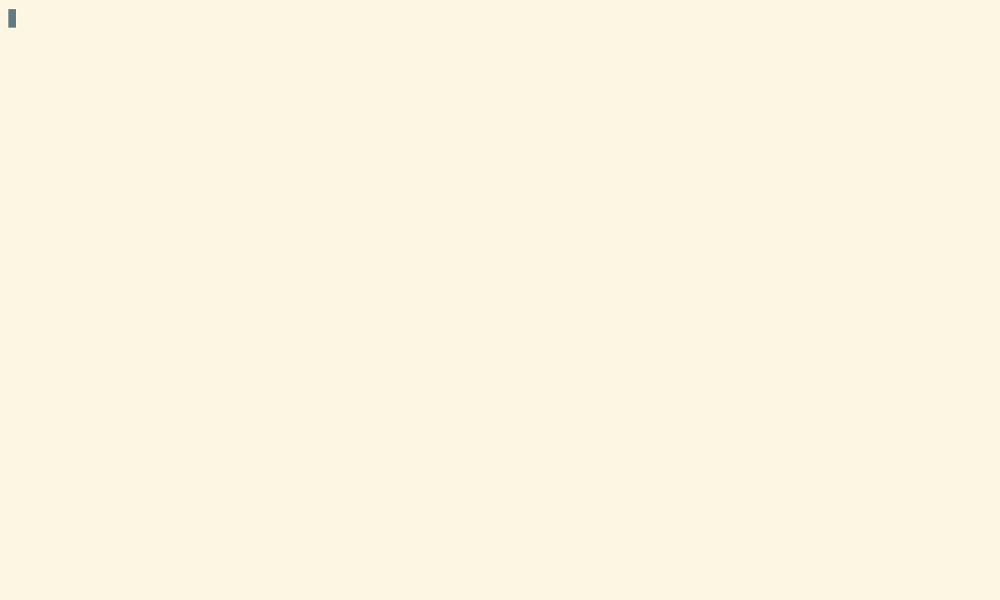

# Research Project Template

This section documents the [Research Project Template](https://github.com/21centuryweather/research-project-template) that follows responsible practices for research projects in climate and weather using Python or R as a programming language. It is meant to help users incrementally incorporate good practices by automatically organising code, analysis, figures and documentation.

Copier is required to use this template. Copier is an open-source tool that creates projects from templates. This template was developed using Copier v9.15.0 and older versions haven't been tested.

## Getting started

1. Load the copier module:

```bash
module use /g/data/gb02/public/modules
module load copier
```

2. Copy the template:

```bash
copier copy --trust gh:21centuryweather/research-project-template .
```

You will be prompted to answer a few questions about your project: the project name, description, and the NCI project you are working on. You can also choose whether you want to use Python or R as your programming language.

3. Answer the questions. 



Depending on the answers, the project using Python may look something like this:

```bash
{{project_name}}/
├── analysis
│   ├── example.ipynb
│   └── figures
│       └── .figures
├── .copier-answers.yml
├── data -> /g/data/{{nci_project}}/$USER/{{project_name}}/data
│   ├── processed
│   │   └── DO_NOT_EDIT
│   └── temp -> /scratch/{{nci_project}}/$USER/{{project_name}}/data/temp
├── .envrc
├── .git
├── .gitignore
├── README.md
├── requirements.txt
├── src
│   ├── __init__.py
│   └── sample_fun.py
└── tests
    └── test_sample_fun.py
```

## Good practices for a research project

### Organise your data

When working on a research project, it is important to organise your data in a way that makes it easy to understand and maintain. The template provides a structure for organising your data, with separate folders for raw, temporal and processed data.

:::{admonition} On gadi
:class: tip

If you create your project on your home directory, which only has 10 Gb available, the template will automatically create a symbolic link to the `/g/data/{{nci_project}}/$USER/{{project_name}}/data` folder on gadi. This way you can work with large data without worrying about running out of space on your home directory.

:::

````{dropdown} How to create a symbolic link
A symbolic link is a special type of file that points to another file or folder. It allows you to access the target file or folder from a different location without having to copy it. For this you need to use the terminal. 

The command is `ln -s /path/to/target /path/to/link`. For instance, if you want to create a symbolic link from /g/data/gb02/$USER/my_project/ to your home directory, you can run this command:

```bash
ln -s /g/data/gb02/$USER/my_project $HOME/
```
If you check with `ls -l` you will see:

```bash
lrwxrwxrwx  1 pc2687 gb02       30 May 29 15:13 my_project -> /g/data/gb02/pc2687/my_project
```
Note: if the link was not created correctly, the previous output will show in red. 

````

**`raw` folder**

To store the raw data that you download from the source. You should never edit this data, and it should be kept as a reference for your analysis. This folder is meant to be read-only.

Consider adding a README file inside the `raw` folder to document the source of the data, the date you downloaded it, and any other relevant information about the data. This will help you and others understand where the data came from and how to use it in the future.

:::{admonition} On gadi
:class: tip

If you are going to work with data that is already available on gadi (like, ERA5, CMIP6, etc), you can also **link** the data into the `raw/` folder and then use relative paths to access it. This way you can keep all your code and data organised in the same root folder, which will make it easier to share and reproduce your analysis.

Alternatively, you can read the data directly from that specific project using absolute paths. To make your project portable, you can specify absolute paths on gadi into a project-specific config file. See [here](https://21centuryweather.github.io/21st-Century-Weather-Software-Wiki/python/package-structure.html#environment-and-configuration-files) for further discussions and [here](https://github.com/21centuryweather/software_engineering_demos/blob/main/solar_example/config.py) for an example.

**Never copy data available on gadi into your project folder**. This will duplicate data and use extra storage space without reason. 

:::

**`temp` folder**

In this folder you will save the temporary data that you create when processing the raw data. The data in this folder won't be used for the final analysis, they are often intermediate files needed for more processing. You should delete them after you finished processing the raw data but save any scripts to be able to reproduce the processing.

:::{admonition} On gadi
:class: tip

Because this is temporal data, the template creates a symbolic link to the `/scratch` folder on gadi. The data in this folder will be automatically deleted after 90 days, so it is a good place to store data that you don't need to keep for a long time or that you can recreate again by running a script. 

:::

**`processed` folder**

In this folder you will save the data that you have cleaned and transformed for the analysis and figures. 
Think about the notebook or script that generates the analysis and figures in your paper. All the data needed, and that you transformed would go to the `processed` folder. 

#### Files you can code with

When saving files, always remember that machines are quite dumb, so be gentle and use file names machines can easily understand.

In some cases, file names with spaces confuse machines, so in general is much easier to code if file names use underscores and hyphens to split words. Similarly, some machines can’t handle "special characters" such as "ñ" or tildes. Some symbols (".", "*", an others) are also best avoided because they have special meaning in regular expressions.

Some file systems are case insensitive, so Madrid-Temperature.csv and madrid-temperature.csv might be the same file!

To avoid any headaches, it is best to be conservative and just use lower-case latin characters, numbers and hyphens ("_" and "-").

Use hyphens as separators. You can use "-" to separate words that are part of the same concept and "_" to separate concepts. For instance `buenos-aires_minimum-temperature.csv`. We recommend this convention and not the other way around, because it’s compatible with the ISO date format ("YYYY-MM-DD").

Finally, try to make your files easily sortable. Put numbers with enough zero-padding and, if relevant, use dates in YYYY-MM-DD format at the beginning of the file name so that sorting by name coincide with sorting by date.

#### Making it portable

An important aspect of thinking about your project is that all scripts, data, figures, and whatever else is needed to (re)create the analysis is inside the same root folder. That way you can ensure that the only thing you need to give to someone else to successfully run your code is that single folder. 

:::{admonition} On gadi
:class: tip

Well, this may not be entirely possible if you are working on a project that relies on data that is only available on gadi, but you can still make your project portable by including scripts to download the data from the source or document exactly how to get it. 

So, even if someone doesn't have access to the data on gadi, they can still run your code and reproduce your analysis by downloading the data from the source and processing it using your scripts.

:::


One extra step to consider is that you cannot make your work portable if your code is not portable too. Perhaps the main culprit of non-portable code is using absolute paths to manipulate files in your code.

`````{tab-set}
````{tab-item} Python

If you use Jupyter labs and set your working directory with `os.chdir()` to the root of your project, you can use relative paths to access your data and figures. The problem with this approach is that your notebook and project won't be portable because will need to set a different working directory every time. 

One solution to this is setting the working directory when starting the ARE session:

1. Configure a Jupyter lab session in ARE.
2. Click Show advanced settings.
3. Write `--notebook-dir=path/to/project` in the “Extra arguments” section.

After that, ARE will start a jupyter lab session using the path you specified as working directory. 

````

````{tab-item} R
Think about this piece of code:

```r
read.csv("/home/dorothy/Documents/research/black-hole/data/data.csv")
```

Even if you correctly downloaded the black-hole folder, this code wouldn’t run because it is unlikely that you saved that folder inside Documents/research and that your username is "dorothy".

Instead, you can use a relative path such as

```r
read.csv("data/data.csv")
```

And this will run no matter where the root folder is located.

The only catch is that you need to make sure that the working directory is set to the root of the project. A a simple solution to make sure that R finds all the files needed is to use the [here package](https://reproducibility.rocks/materials/day2/01-here/).

````
`````

### Organise your code

When working on a research project, it is important to organise your code in a way that makes it easy to understand and maintain. The template provides a structure for organising your code, with separate folders for analysis, and source code.

`````{tab-set}
````{tab-item} Python
What's the difference between the `analysis` and `src` folders? The `analysis` folder is meant for Jupyter notebooks (or scripts) that contain your analysis and figures, while the `src` folder is meant for Python scripts that contain functions and classes that you can reuse across different notebooks.

If you said yes to adding an example when creating the project structure you will find a sample function in:

`src/sample_fun.py`
```python
def add_numbers(x, y):
    """Returns the sum of x and y."""
    return x + y
```
And a notebook `analysis/example.ipynb` that shows how to import and use this function:

```python
import sys
sys.path.append('../src/python_project')
from sample_fun import add_numbers
```

The idea here is to keep the notebooks clean and focused on the analysis, while keeping functions organised. This structure will also allow you to reuse the functions across different notebooks and to avoid copying and repeating code. The code will be more easy to maintain. If you need to update a function or add a new feature, you will need to make the changes in one place only. 

Moving forward, you can also add tests for your functions in the `tests` folder, which will help you ensure that your code is working as expected and will make it easier to maintain and update your code in the future.

````

````{tab-item} R
When working in an R project, the `analysis` folder is meant for R markdown or Quarto files that contain your analysis and figures, while the `R` folder is meant for R files that contain functions that you can reuse across different Quarto files.

If you said yes to adding an example when creating the project structure you will find a sample function in:

`R/functions.R`
```r
#' Adds two numbers together. 
#' 
#' @param x,y numbers to add up
#' 
add_numbers <- function(x, y) {
  x + y
}
```
And the `analysis/manuscript/manuscript.qmd` notebook can import and use this function:

```r
# Source helper functions
source(list.files("R", full.names = TRUE))
```

```r
add_numbers(1, 1)
```
The idea is to keep the quarto file clean and focused on the analysis, while keeping functions organised. This structure will also allow you to reuse the functions across different quarto files and to avoid copying and repeating code. The code will be more easy to maintain. If you need to update a function or add a new feature, you will need to make the changes in one place only. 

Moving forward, you can easily convert your collection of functions into a package, which will make it easier to share and reuse your code across different projects.

````
`````
### Document your code

Documenting your code is an important aspect of making your project reproducible and maintainable. Even if you are not planning to share your code with anyone else, you will be grateful to yourself in the future if you document your code properly. 

Documentation can be as simple as adding comments to your code to explain what it does and, more importantly, why you are doing it. You can also use docstrings in Python or roxygen2 in R to document your functions and classes, which will make it easier for you and others to understand how to use them.

`````{tab-set}
````{tab-item} Python
In Python, functions are usually documented using docstrings, which are string literals that appear right after the function definition. A docstring should describe what the function does, its parameters, its return value and examples. The example in the template includes a bare-bones docstring:

```python
def add_numbers(x, y):
    """Returns the sum of x and y."""
    return x + y
```
A better version of the documentation would be:

```python
def add_numbers(x, y):
    """
    Returns the sum of x and y.

    Parameters
    ----------
    x: int
        The first number.
    y: int
        The second number.

    Returns
    -------
    int
        The sum of x and y.

    Examples
    --------
    >>> add_numbers(2, 3)
    5
    """
    return x + y
```

With this structure you can easily understand what the function does and how to use it. Moving forward, you ever want to convert your collection of functions into a package, having docstrings will make it easier to create the documentation for your package.

````

````{tab-item} R

In R, functions are usually documented using roxygen2, which is a package that allows you to write documentation in the same file as your code. The documentation is written in a special format that starts with `#'` and includes tags such as `@param`, `@return`, and `@examples`. The example in the template includes a bare-bones documentation:

```r
#' Adds two numbers together. 
#' 
#' @param x,y numbers to add up
#' 
add_numbers <- function(x, y) {
  x + y
}
```
A more complete version of the documentation would be:

```r
#' Add together two numbers
#' 
#' @param x A number.
#' @param y A number.
#' @return The sum of \code{x} and \code{y}.
#'
#' @examples
#' add_numbers(1, 1)
#' add_numbers(10, 1)
#' @export
add_numbers <- function(x, y) {
  x + y
}
```
While roxigen2 syntax can be hard to remember, rstudio has an option to insert the skeleton automatically. This structure will help you to add all the necessary details so you can easily understand what the function does and how to use it. Moving forward, you ever want to convert your collection of functions into a package, using roxygen2 will make it easier to create the documentation for your package.

````
`````
### Document your project

The template provides a `README.md` file where you can write a description of your project, how to run the analysis and get access to the data. This file is meant to be read by other people who want to understand what your project is about and how to use it. If you share your project on GitHub, the README file will be the first thing that people see when they visit your repository, so it is important to make it clear and informative.

You can also include information about how to cite your research project. This can be the citation associated to the paper, if you have one, or you can create a Zenodo record for your project (everything in the repository) and include the DOI in the README file. This way, people who want to use your code and data can easily find the citation information and give you credit for your work.

Check this examples for inspiration on how to write a good README file:

* [Gradient-boosted equivalent sources](https://github.com/compgeolab/eql-gradient-boosted)
* [The Importance of Initial Conditions in Seasonal Predictions of Antarctic Sea Ice](https://github.com/eliocamp/access-s2_ice-eval)
* [Using rapid temperature falls to estimate future strong cold front frequency in CMIP6 climate projections](https://github.com/paocorrales/t-drop-trends/)

### Manage your dependencies

`````{tab-set}
````{tab-item} Python

If if you rely on `conda/analysis3` environments, it's still important to keep track of the dependencies you are using in your project. The template provides a `requirements.txt` file where you can list all the packages you are using in your project. This way, you can easily recreate the environment in another machine or share it with someone else.

When you are ready to create this file, load your environment and run this in the terminal after activating your environment:

```bash
cd /path/to/project
python3 -m pip freeze > requirements.txt
```
If you are interested in learning more about how to manage a python environment or how to create your own, check the section [Building custom python environments on top of `conda/analysis3`](content:conda-env).


````
````{tab-item} R

The best tool to manage dependencies in R is the `renv` package. This package allows you record the dependencies in your project, which can be easily shared and reproduced. If you said yes to using renv when creating the project, the template will install and initialise renv. Check that you have an `renv.lock` file and `renv/` folder inside your project. 

To learn more about how to use renv, check the [package documentation](https://rstudio.github.io/renv/) or [this tutorial from reproducibility.rocks](https://reproducibility.rocks/materials/day3/01-renv/).


````
`````
### Version control

The template gives you the option to use git for version control. If you choose to use git, the template will automatically initialise a repository and you will see a `.git` folder for you, which is where git stores all the information about your commits and branches. git (and Github) is key to share your code and collaborate with other people, so we highly recommend using it for your projects. 

If you are new to git, check the [Working with Git alone](content:git-alone) and [Working with Git in a team](content:git-team2) sections of the wiki. 


#### .gitignore

If you choose to use git in your project, the template will create a `.gitignore` file for you. This file is used to tell git which files and folders to ignore when you commit your changes. The template includes some common files and folders that you should ignore depending on the programming language you are using. 

For all cases, the `data/` folder will be ignored. It's not recommended to track this folder on git because usually include big files that cannot be added to GitHub. Data usually have specific licenses and you need to check if you are allowed to share it. If that's the case, we recommend sharing the data through a data repository such as [Zenodo](https://zenodo.org/) and then adding the link to the data in your README file. 21st Century Weather has a Zenodo community where you can share your data and code: https://zenodo.org/communities/21stcenturyweather.


 ## References

* [An R reproducibility toolkit for the practical researcher](https://reproducibility.rocks/)
* [A Python Project Template for Healthy Scientific Software](https://iopscience.iop.org/article/10.3847/2515-5172/ad4da1)
