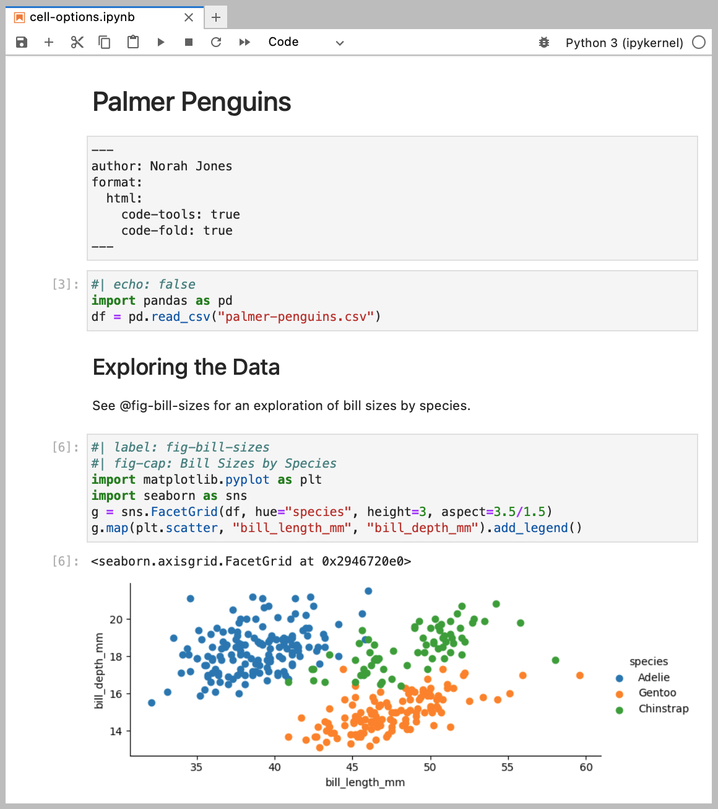

# Literal programming with quarto  

Quarto is a an open-source scientific and technical publishing system. It can be used through jupyter notebooks or plain text files with the `.qmd` extension. Quarto supports a variety of programming languages, including Python, R, Julia, and others.

It can produce a wide range of output formats, including journal articles, presentations, dashboards, websites, blogs, and books in HTML, PDF, MS Word, ePub, and more. 

This is very important when writing scientific articles, as it allows you to write your text and code in the same file, and then render the output in the desired format using the template form the journal you've chosen. This is known as "literal programming", where the code is embedded in the text, and the output is generated from the code. By writing everything in the same file, you can ensure that the code and the text are always in sync, and you can easily update the code and the text together. It is a step forward in making your research reproducible and shareable.

## Quarto in Jupyter notebooks

Adding quarto to your usual workflow is very straightforward. You only need a to add a yaml header to your notebook to configure the output format. In this example, we set the author name, the format to HTML, and a drop down menu to show-hide code cells. 



To generate the HTML file, it is enough to run the command `quarto render <name of the file>` in the terminal. The output will be saved in the same directory as the notebook, with the same name but with a `.html` extension.

You can also install the [jupyter extension `quarto-jupyter`](https://quarto.org/docs/tools/jupyter-lab-extension.html) to better visualise the the header and call outs. 

## Quarto in plain text files

Quarto can also be used with plain text files with the `.qmd` extension. The advantage of using plain text files is that they are easier to version control and share with others. The downside of this is that you won't see the output of your code (figures and results) on GitHub unless you render the file into markdown or html.

To work with a `.qmd` file, you can use any text editor. If you are planning to user R code, RStudio is a great option, as it has built-in support for Quarto. If you are using Python, you can use any text editor or IDE, such as VSCode, check [these instructions on how to open an ARE session from VSCode](/gadi/vscode.md).

On VSCode you will need to install the [Quarto extension](https://marketplace.visualstudio.com/items?itemName=quarto.quarto-vscode) to get syntax highlighting and other features. Connect to Gadi using the Remote - SSH extension on the login node to access internet and install the extension. 

While you can install quarto on your home directory, we recommend using the version installed on `gb02`. Add the following path to the extension settings or directly in your `PATH`:

```bash
/g/data/gb02/pag548/quarto-1.7.29/bin/
```


### Elements of a `.qmd` file

A `.qmd` file is a plain text file that contains both text and code. The text is written in markdown, and the code is written in the programming language of your choice (Python, R, Julia, etc.).


**YAML header**: The file starts with a YAML header that contains metadata about the document, such as the title, author, date, and output format. This header is enclosed in `---` lines. For a simple file it might only includes the title and output format but it can also include other options particularly if you are using a journal template.

The indentation is important, it will not run if their is a extra space or a tab in the header. 

**Text**: The text is written in markdown, which is a lightweight markup language that allows you to format text using simple syntax. You can use headings, lists, links, images, and other formatting options. In quarto it is also possible to add Latex equations and citations. In the example above, we reference a figure using `@fig-polar`, the label of the figure that is defined in the code chunk. Similarly it is possible to reference tables and equations using their labels. For citations, you will need to add a bibliography file in the YAML header (a `.bib` file), and use the `@citation-key` syntax to reference the citations in the text. Check the quarto documentation about [citations](https://quarto.org/docs/get-started/authoring/vscode.html#citations) and [cross-references](https://quarto.org/docs/get-started/authoring/vscode.html#cross-references) for more details.

There are many VSCode extensions that can help you with markdown syntax, and citation. 

**Code chunks**: Code chunks are enclosed in triple backticks (```) and start with the language name, such as `python`, `r`, or `julia`. You can insert a new chunk with `Ctrl/Command + Shift + I` and run each chunk with `Ctrl/Command + Enter`. 

You can also add options to the code chunks, such as `echo`, `eval`, `fig.width`, `fig.height`, and others. These options control how the code is displayed and executed. For example, if you want to hide the code but show the output, you can use `echo: false`. If you want to include a figure with a specific width and height, you can use `fig.width: 6` and `fig.height: 4`. In the example, 2 options are used: `fig.cap` to add a caption to the figure, and `label` to reference the figure in the text. Check the section about [figures](https://quarto.org/docs/get-started/computations/vscode.html#figures) to see other options. Setting the `label` option is very useful in case you get an error during the rendering, as it will show you the name of the chunk that failed.

The chunk options can be set globally in the YAML header, so you don't have to repeat them in every chunk. For example, you can set `echo: false` to hide all code chunks by default.

### Using analysis3 environment in quarto

Using the analysis3 environment in quarto is similar to using it in Jupyter notebooks. You will need to spin up an ARE session with the corresponding projects and advance options. Then, you can choose the python interpreter from the analysis3 conda environment in VSCode following the steps:

1. Open the command palette (Ctrl+Shift+P or Cmd+Shift+P on Mac) and type "Python: Select Interpreter".
2. You will see a list of available interpreters, including those from your conda environments. Most probably the `analysis3` won't be on the list so you will need to add it manually by typing the path to the interpreter in the command palette. So, select "Enter interpreter path..." and copy the path. The path to the `analysis3` conda environment will be `/g/data/xp65/public/apps/med_conda_scripts/analysis3-XX.XX.d/bin` but replacing XX.XX by the corresponding version of the environment you want to use. For example, 25.06.

After that, you should be able to run the code chunks in your `.qmd` (the result will show in the interactive window) with that specific environment.

To preview the rendered output you can use the command `quarto preview <name of the file>` or the shortcut `Ctrl/Command + Shift + K`. You can also render the file with `quarto render <name of the file>` from the terminal in VSCode. Make sure to load the `xp65` and `conda/analysis3` modules before running the command.

```bash
module use /g/data/xp65/public/modules
module load conda/analysis3-XX.XX
```

If you want to make sure you are always using the same conda environment when you render the file (for reproducibility or maybe because your code only works with specif versions of the modules) you can add the following line to the YAML header:

```yaml
---
title: "Example Quarto Document"
format: html
jupyter: 
  kernelspec:
    name: "analysis3-XX.XX"
    language: "python"
    display_name: "analysis3-XX.XX"
---
```

Replacing XX.XX by the corresponding version of the environment you want to use.

For this to work, it requires to install the kernel for the conda environment. You can do this by running the following command in the terminal after you loaded the `conda/analysis3-XX.XX` module:

```bash
python -m ipykernel install --user --name=analysis3-XX.XX
```

