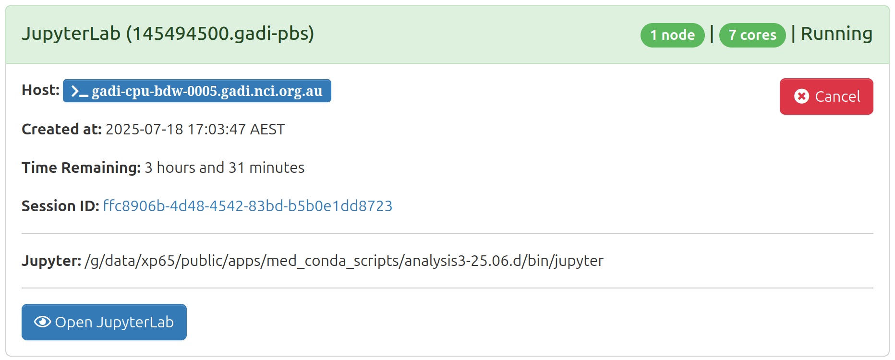

# Working with VS Code on Gadi

VS Code, short for Visual Studio Code, is an incredibly useful code editor. Its versatility and feature-rich environment make it a go-to tool for programmers across different programming languages and platforms. VS Code boasts a user-friendly interface and has powerful editing capabilities, including syntax highlighting, code completion, and intelligent debugging. Additionally, VS Code supports a vast range of extensions, enabling developers to customize their environment with functionalities specific to their needs. The integrated source control management and collaboration features further streamline the development workflow, making it easy to work on projects individually or as part of a team. Furthermore, VS Code’s lightweight nature and cross-platform compatibility ensure that developers can work effortlessly on different operating systems.

## 0. Install VS Code

In first place you will need to install VS Code in your computer. Follow the instructions on the [VS Code website](https://code.visualstudio.com/docs/setup/setup-overview) according to your operating system.

In there you will also see a list of extensions that you can install to enhance your VS Code experience. Some of the most useful extensions for working with Gadi include:
- [Remote - SSH](https://marketplace.visualstudio.com/items?itemName=ms-vscode-remote.remote-ssh): This extension allows you to connect to remote servers via SSH, enabling you to work on files directly on Gadi.
- [Remote - SSH: Editing Configuration Files](https://marketplace.visualstudio.com/items?itemName=ms-vscode-remote.remote-ssh-edit): This extension helps you manage your SSH configuration files, making it easier to set up and maintain connections to remote servers.
- [Python](https://marketplace.visualstudio.com/items?itemName=ms-python.python): This extension provides rich support for the Python programming language, including features like IntelliSense, linting, and debugging.
- [Jupyter](https://marketplace.visualstudio.com/items?itemName=ms-toolsai.jupyter): This extension allows you to work with Jupyter notebooks directly within VS Code, making it easier to run and edit notebooks
without leaving the editor.
- [Markdown All in One](https://marketplace.visualstudio.com/items?itemName=yzhang.markdown-all-in-one): This extension provides comprehensive support for Markdown files, including preview, formatting, and table of contents generation.     

Remote - SSH is particularly important for working with Gadi, as it allows you to connect to the Gadi server and edit files directly on the remote machine.

## 1. Connect to Gadi

You could connect to a login node if you are only editing code or documentation. But if you want to run code, you will need to spin up a ARE session and connect to it using the Remote - SSH extension in VS Code.

### 1. Start a ARE session

Once it has started you need to take note of the name of the compute node:



### 2. Configure SSH (only once)

Config SSH to connect to the compute node by adding the following lines to your `~/.ssh/config` file (in your local machine):

```
Host gadi.nci.org.au
  HostName gadi.nci.org.au
  ForwardX11 yes
  User <your_username>

Host gadi-cpu-*
  HostName %h
  User <your_username>
  ProxyJump gadi.nci.org.au
``` 

You probably already have something similar to the first block, but you need to add the second block to allow VS Code to connect to the ARE session. In the second block, `%h` will be replaced by any host name starting with `gadi-cpu-`. So, when you connect to the compute node in the next step, VS Code will **automatically** add the corresponding host to this file. And you don't need to manually add a new host everytime.

The `ProxyJump` directive indicates that the connection to this host should go through the “gadi” host. This configuration is useful when there is an intermediate jump host required to connect to the final destination. 

### 3. Connect to the ARE session

On VS Code, open the command palette (Ctrl+Shift+P or Cmd+Shift+P on Mac) and type "Remote-SSH: Connect to Host...". Select the compute node you copied when the ARE session started. Follow the instructions. VS Code will then connect to the compute node, and you will be able to open files and folders on Gadi.

## 3. Use a analysis3 conda environment

To use a specific conda environment in VS Code, you need to select the interpreter for that environment. 

1. Open the command palette (Ctrl+Shift+P or Cmd+Shift+P on Mac) and type "Python: Select Interpreter".
2. You will see a list of available interpreters, including those from your conda environments. Most probably the `analysis3` won't be on the list so you will need to add it manually by typing the path to the interpreter in the command palette. The path to the `analysis3` conda environment will be `/g/data/xp65/public/apps/med_conda_scripts/analysis3-XX.XX.d/bin/python` but replacing XX.XX by the corresponding version of the environment you want to use. For example, 25.06.
3. This will now be available in the jupyter kernel.


Instructions adapted from the [CLEX CMS Blog](https://coecms.github.io/index.html).