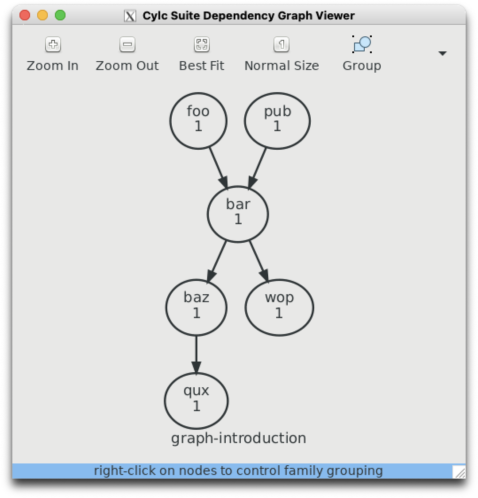

# Introduction to Rose/Cylc

Running an atmospheric simulation is a complex process which requires executing many separate tasks. In order to co-ordinate these tasks, we requirer a job scheduler, or a **workflow engine**.

These tutorials assume:
1. You have an NCI account on `gadi`.
2. You can access a command-line terminal on `gadi` (either via an `ssh` session or using the `ARE` research environment)
3. You have, or in the process of obtaining, a UK Met Office Science Repository Service (MOSRS) account.
4. You have memberships to the following `gadi` projects:
    - `hr22`
    - `access`
    - `ki32`
    - `ki32_mosrs`

## Shell scripts and running jobs on Linux

Typically we run programs (or apps) on a linux computer using a shell scripts. We use the `bash` shell to interpret input from the command-line to execute programs.

For example, if you login to `gadi` and type `ls -la`, at the command-line you are executing the program `ls` with the additional arguments `la`. The output of the program is then directed via standard output to your terminal.

We can then create bash 'scripts' which allows to us process multiple inputs and to automate tasks from the command line instead of having to type everything manually.  A bash script is simply a text file with a list of commands, which we give special permissions to which allow the Linux operating system to execute it as a program.

If you want more familiarity with `bash`, there are many on-line tutorials and references available, e.g.:

https://www.freecodecamp.org/news/bash-scripting-tutorial-linux-shell-script-and-command-line-for-beginners/

or

https://www.geeksforgeeks.org/bash-scripting-introduction-to-bash-and-bash-scripting/

You can follow those tutorials on `gadi` but you will need to use a different text editor to `gedit` as it is not installed. You can use `vi` if you're familiar with it, otherwise you can use `nano` which will run inside a terminal window, or type `nedit &` to launch the `nedit` GUI text editor.  The `&` tells bash to run this job 'in background', which allows you to continue typing inputs via the command-line while the `nedit` window is active.

A deeper `bash` reference can be found here:

https://learn.microsoft.com/en-us/training/modules/bash-introduction/

Depending on your prior experience with Linux and `bash`, you may want to spend a few days working through these tutorials and examples to gain a better understanding of how `bash` commands and `bash` `ENVIRONMENT` variables work and familiarise yourself with the Linux directory structures on `gadi`.

Typically you will use `bash` scripts to execute programs required to simulate the atmosphere, whether these programs are pre-compiled executables (e.g. the UM itself), python scripts for pre-processing or post-processing, or bash commands themselves.

When we execute programs from the command-line, we are using an 'interactive' session. Typically this is used for small programs that require very few resources (memory, processors, disk space) and can be executed in a few seconds or minutes. For larger tasks, a super-computer uses a batch-scheduling system whereby `bash` scripts are submitted to a job scheduler queue with requests for memory, processors and storage. The job scheduler then processes each jobs when resources become available.

The NCI supercomputer `gadi` uses the `PBS` job scheduler. Documentation is available here:

https://opus.nci.org.au/pages/viewpage.action?pageId=236880320

But, what if we have a complex set of tasks that must run in a particular sequence? Can we create programs which process `PBS` jobs in a user-specified workflow?  

## Task Scheduling for Atmospheric Simulation

A good example of a complex tasks that must run in a particular sequence is a  realtime atmospheric simulation (i.e. a weather forecasts).  Typically for a longer, multi-day forecast, the sequence of tasks involves:
1. Reading the previous weather forecast data initialised some six hours ago
2. Collect observations valid from three hours ago, to three hours in the future
3. Running a perturbation forecast model with an optimisation tool to determine the initial condition which minimises the error between short-term forecasts and observations over a six hour period. 
4. Use the optimal initial condition computed earlier to run another short term forecast. These short term forecasts which have been computed against observations are known as 'analysis' or 'analyses'. They are our best estimate of the three-dimensional structure of the atmosphere at any point in time. 
5. Repeat the analysis computation every six hours.
5. Every 12 hours, run a longer forecast (e.g. 7 days into future)

Repeating this process in realtime 24/7 requires the interaction of many separate tasks. We need a system which submits programs, monitors their progress, keeps track of the current time and executes each task according to an ordered set of dependencies (i.e some tasks cannot run until some upstream tasks have finished). 

In order to do this, we require what is known as a workflow engine, which is a fancy name for a task scheduler.  

## The Cylc work engine 

Recently, the New Zealand National Institute of Water and Atmospheric Research (NIWA) developed its own task scheduler to handle its operational workflows - **cylc**. This scheduler was so elegant, powerful and (relatively) simple to use that it was adopted by the UK Met Office, who wrapped an external software layer - **rose** - around the `cylc` engine. 

Every time you run an atmospheric simulation using the UK Met Office `Unifed Model` (`UM`), you will be using `cylc`.

When we refer to `rose/cylc`, we are referring to a `rose` framework (which constitutes various GUI tools, scripts and namelists) which launch the `cylc` workflow engine.

To understand how `cylc` works, visit the documentation here:

https://cylc.github.io/cylc-doc/7.9.3/html/index.html

Note the `gadi` is still using an earlier version of `cylc` (7.9.3) so make sure you select the correct version. The latest version of `cylc` (8.3.4) contains some significant differences.

### First cylc tutorial ###

Let's run through the tutorial here: 

https://cylc.github.io/cylc-doc/7.9.3/html/tutorial.html

To launch `cylc` on `gadi` you need to load the `cylc` software into your interactive command-line session. Execute the following commands from your `gadi` terminal:
```
module use /g/data/hr22/modulefiles
module load cylc7/23.09
```
This should generate the following output:
```
Loading cylc7/23.09
  Loading requirement: mosrs-setup/1.0.1
```

Follow the instructions in section 7.6 - 7.9 of the tutorial. Begin with

```
$ cylc import-examples /tmp
```

This will create a list of cylc examples files in 
```
~/cylc-run/examples
```
Remember `~` is a short-cut which refers to your home directory on `gadi`.

All your future `rose/cylc` tasks to run the `UM` will also be deployed in your `~/cylc-run` directory.

Let's run the 'Hello World' example. Go to the following path in `~/cylc-run` directory (the path is actually different to the official documentation):
```
cd ~/cylc-run/examples/7.9.7/tutorial/oneoff/basic
```
Using a text editor of your choice (`vi`, `nedit`, `nano`, `emacs`, `Microsoft VS Code`), copy the contents from the tutorial into a file named `suite.rc`.

Once complete, if you examine the contents of this file using the bash command-line program `more`, it should resemble this:
```
 $ more suite.rc 
[meta]
    title = "The cylc Hello World! suite"
[scheduling]
    [[dependencies]]
        graph = "hello"
[runtime]
    [[hello]]
        script = "sleep 10; echo Hello World!"
```
Ok, let's run this from the command line. Your output should contain the following.
```
$ cylc run

Loading cylc7/23.09
  Loading requirement: mosrs-setup/1.0.1
            ._.                                                       
            | |                 The Cylc Suite Engine [7.9.7]         
._____._. ._| |_____.           Copyright (C) 2008-2019 NIWA          
| .___| | | | | .___|   & British Crown (Met Office) & Contributors.  
| !___| !_! | | !___.  _ _ _ _ _ _ _ _ _ _ _ _ _ _ _ _ _ _ _ _ _ _ _ _
!_____!___. |_!_____!  This program comes with ABSOLUTELY NO WARRANTY;
      .___! |          see `cylc warranty`.  It is free software, you 
      !_____!           are welcome to redistribute it under certain  

*** listening on https://pgregory.pag548.gb02.ps.gadi.nci.org.au:43080/ ***

To view suite server program contact information:
 $ cylc get-suite-contact basic
```
Congratulations! You've just run your first `cylc` suite. 

### Second cylc tutorial ###

Let's move onto another `cylc` tutorial, which is located in the `rose` documentation. This tutorial deals with creating graphs, i.e. how we dictate the sequence in which tasks are run. The version of `rose` currently running supported on `gadi` for ACCESS-UM experiments is `2019.01.7` so make sure you using the following URL : 

https://metomi.github.io/rose/2019.01.8/html/tutorial/cylc/scheduling/graphing.html

Let's follow the instructions at the bottom of the page.

**Remember!!** we have to use the following `module use` and `module load` commands to add `rose` and `cylc` to our paths on gadi, in case you are starting this tutorial from a fresh login session.
```
module use /g/data/hr22/modulefiles
module load cylc7/23.09
```

Back to the tutorial:
```
mkdir ~/cylc-run/graph-introduction
cd ~/cylc-run/graph-introduction
```
Create a `suite.rc` file in this directory using the template provided, and then create a task graph using the necessary syntax. When you execute
```
cylc graph .
```
the results show match the below image.



https://metomi.github.io/rose/2019.01.8/html/tutorial/rose/applications.html

What is the link wit