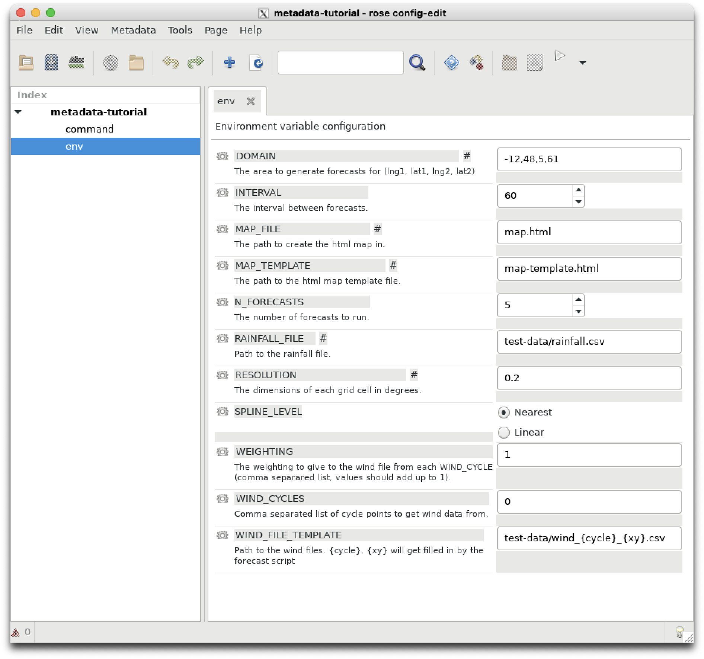

## First Rose tutorial ##

Now we will construct our first `rose` suite to learn how `rose` uses configuration files to pass parameters (typically `bash` environment variables or `fortan` namelists) to tasks controlled by `cylc`.

A `rose` "application" is a rose configuration which executes a defined command.

Let's run through the exercises available here:

https://metomi.github.io/rose/2019.01.8/html/tutorial/rose/applications.html

Once your `rose` application has been complete, you should be able to execute it and generate outputs similar to those below.
```
$ rose app-run -C ../
[INFO] export CYLC_TASK_CYCLE_POINT=20171101T0000Z
[INFO] export DOMAIN=-12,48,5,61
[INFO] export INTERVAL=60
[INFO] export MAP_FILE=map.html
[INFO] export MAP_TEMPLATE=map-template.html
[INFO] export N_FORECASTS=5
[INFO] export PATH=/home/548/pag548/rose-tutorial/application-tutorial/bin:/g/data/hr22/apps/cylc7/rose_2019.01.7/bin:/g/data/hr22/apps/cylc7/23.09/bin:/g/data/hr22/apps/mosrs-setup/1.0.1/bin:/home/548/pag548/.local/bin:/home/548/pag548/bin:/opt/pbs/default/bin:/opt/nci/bin:/opt/bin:/opt/Modules/v4.3.0/bin:/bin:/usr/bin:/usr/local/sbin:/usr/sbin:/opt/pbs/default/bin
[INFO] export RAINFALL_FILE=test-data/rainfall.csv
[INFO] export RESOLUTION=0.2
[INFO] export WEIGHTING=1
[INFO] export WIND_CYCLES=0
[INFO] export WIND_FILE_TEMPLATE=test-data/wind_{cycle}_{xy}.csv
[INFO] install: map-template.html
[INFO]     source: /home/548/pag548/rose-tutorial/application-tutorial/file/map-template.html
[INFO] create: test-data
[INFO] install: test-data
[INFO]     source: /home/548/pag548/rose-tutorial/application-tutorial/file/test-data
[INFO] command: forecast $INTERVAL $N_FORECASTS
Plotting diasbled
```
If you plot the file `~/rose-tutorial/application-tutorial/run/map.html` it should resemble this:


## Second Rose tutorial ##

In the next `rose` tutorial you will learn how to add metadata to a rose suite. Metadata has a variety of uses in a `rose` suite. Follow the exercises located below to find out what they are.

https://metomi.github.io/rose/2019.01.8/html/tutorial/rose/metadata.html

> **__NOTE__** In this tutorial the command `rose config-edit &` is used to edit the rose suite. In most of the 21st Century Weather and ACCESS-NRI documentation, the short-cut `rose edit &` is used instead.

At the conclusion of this tutorial, your `rose edit` window should look like this.



## Third Rose tutorial ##

In this tutorial you will bring all of your knowledge of `rose` and `cylc` together to start, stop and restart a fully integrated `rose/cylc` suite.

You will learn how to control the overall configuration of a `rose/cylc` suite using the `rose-suit.conf` file.

Follow the exercises contained in this link:

https://metomi.github.io/rose/2019.01.8/html/tutorial/rose/suites.html

> **__NOTE__** This exercise refers to `Jinja2`. Jinja is a templating language, i.e. a way to create extensive ASCII (text) documents by using a logic to loop over variables or parameters to prevent repetitive typing of repeated strings or text. The homepage for the Jinja project is here:
> 
> https://jinja.palletsprojects.com/en/stable/
>
> There is short review of how `Jinja` works here : https://metomi.github.io/rose/2019.01.8/html/tutorial/cylc/runtime/configuration-consolidation/jinja2.html. You don't have to do the tutorials, but just be conscious that whenever you see braces such as `{{ }}` in a `suite.rc` file, those braces surround a variable that will be replaced with Jinja. Likewise, Jinja logic such as `` or `{% for ... }` within the `suite.rc` will be processed to produce the final `suite.rc.processed` file which is the actual file executed by `cylc` which is created in your `~/cylc-run/<rose-id>` directory.
> In conclusion, Jinja is a way for us to create very long `suite.rc` files by looping over input parameters.


I had to make the following changes to `suite.rc` to make the tutorial work. 
```
[jinja2:suite.rc]
    station="camborne", "heathrow", "shetland", "aldergrove","belmullet"
 ```
 Otherwise the suite will not run It will fail will the following errors:
```
[INFO] install: suite.rc
[INFO] REGISTERED rose-suite-tutorial -> /home/548/pag548/cylc-run/rose-suite-tutorial
[FAIL] cylc validate -o /scratch/gb02/pag548/tmp/tmp45a3jD --strict rose-suite-tutorial # return-code=1, stderr=
[FAIL] ERROR, parameter station out of range: station=belmullet
```
I tracked down the error using the `bash` command `grep` which searches for strings in ASCII (text) files.
```
$ grep belmullet *
grep: app: Is a directory
grep: bin: Is a directory
grep: lib: Is a directory
grep: meta: Is a directory
suite.rc:    [[get_observations<station=belmullet>]]
```
This told me that one of the tasks in `suite.rc` expects a station value of `belmullet`. So I added it to the list of station variables defined in `rose-app.conf`. Another solution would be to remove the task `[[get_observations<station=belmullet>]]` from the `suite.rc` file.

To check the suite has been installed correctly, your `~/cylc-run/rose-suite-tutorial/` directory should contain the following:
```
$ ls ~/cylc-run/rose-suite-tutorial/
app  bin  lib  log  meta  share  suite.rc  work
```
Note the `suite.rc` file installed in your `~/cylc-run/rose-suite-tutorial/` directory now contains `jinja` directives appended to the beginning of the file.
```
$ more ~/cylc-run/rose-suite-tutorial/suite.rc 
#!jinja2
{# Rose Configuration Insertion: Init #}






[cylc]
    [[environment]]
        CYLC_VERSION=7.9.7
        DOMAIN=-12,48,5,61
        RESOLUTION=0.2
        ROSE_ORIG_HOST=gadi-login-09.gadi.nci.org.au
```

Can't get the last tutorial to work because 

IOError: [Errno 2] No such file or directory: '/home/548/pag548/cylc-run/rose-suite-tutorial/etc/met-office
-sites.dat'

Try again on Thursday