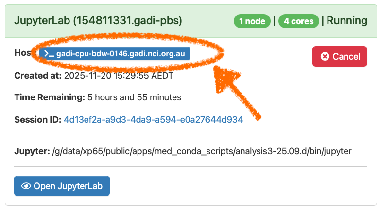
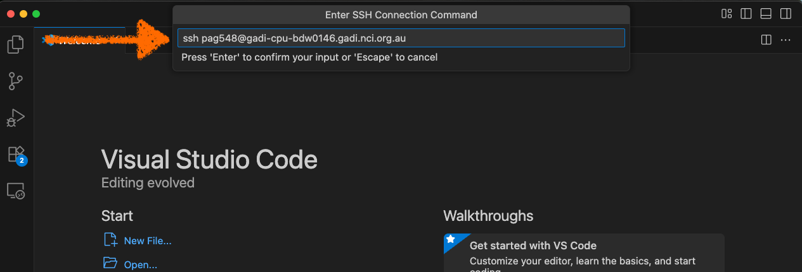
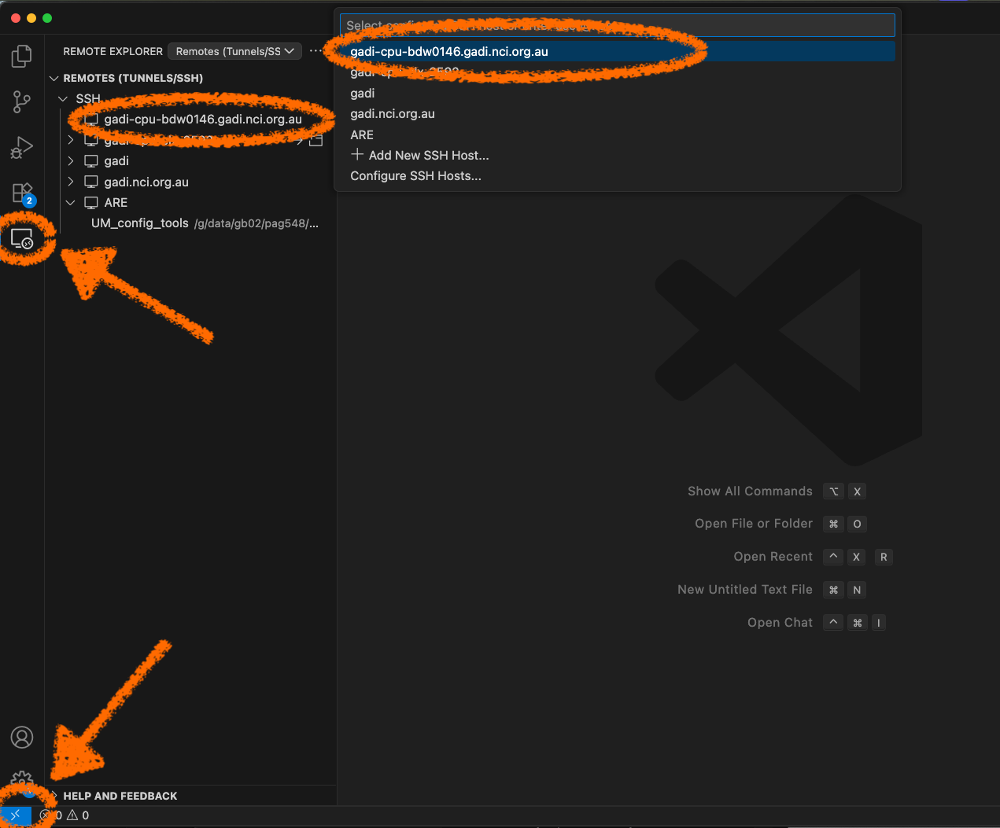

# Running VSCode on gadi ARE session

Connecting a VSCode window your an ARE Jupyter notebook session uses the same method to connect to a `gadi` compute node.

Again, we will rely on the use of the `ProxyJump` inside our `ssh` configuration file to connect to the ARE Jupyter notebook server via a `gadi` login node.

The difference is we need to start an ARE session, rather than an interactive `qsub`.

So, login to https://are.nci.org.au as normal and start your JupyterLab session as normal. Take note of the ID of the compute node hosting your JupyterLab session.

Then use the Remote-SSH button on the bottom left corner to connect to a new session, and click `+ Add New SSH Host`

In this example I type `ssh <username>@gadi-cpu-bdw-0146.gadi.nci.org.au`

This will add this host to our `~/.ssh/config` file. Once this has been updated, we can connect to the compute node hosting the JupyterLab session in two ways
1. Via the Remote-SSH button in the bottom-left, which will provide a list of configured remote hosts in the central pull-down menu, or
2. Use the Remote Explorer icon in the left vertical taskbar and select the remote host we want from the list in `REMOTE EXPLORER` column.

